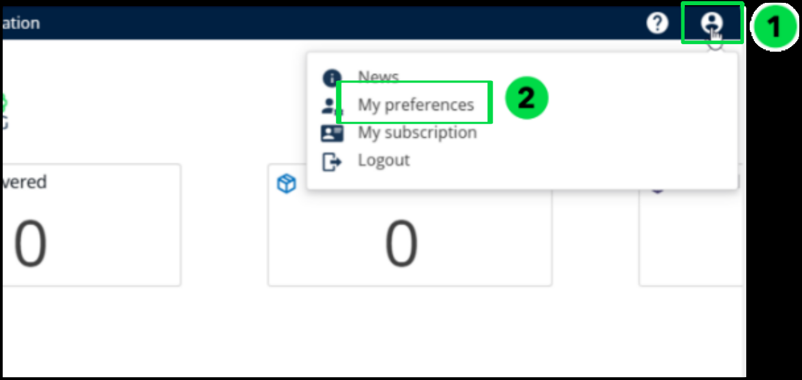

# 2. Home Page

### 1. Understanding the Home Screen 

The Home Screen is the default landing page when you access Nomadia Delivery. It provides an operational overview of your delivery activity, highlighting key performance indicators, mission statuses, and quick links to core functionalities. This screen is designed to help users navigate efficiently while staying informed about logistics operations in real time.

### 2. Key Areas of the Home Screen

<table data-header-hidden><thead><tr><th width="83.4000244140625" valign="top">Code</th><th valign="top">Section</th><th valign="top">Purpose</th></tr></thead><tbody><tr><td valign="top">1</td><td valign="top">Navigation Tabs</td><td valign="top">
Access the main parts of the app:

Missions – Provides a unified view of all missions with support for planning, tracking, and optimization based on 100+ constraints.

Dashboard – Provides data visualization tools to monitor missions, routes, administrative KPIs, fulfillment KPIs, and other key metrics.

Fulfillment – Used for tracking live locations and monitoring mission progress with Proof of Delivery (PoD) at the route level

Configuration – Customize the app to your needs.
</td></tr><tr><td valign="top">2</td><td valign="top">User and Help Icons</td><td valign="top">
Top-right icons:

Help Me – FAQs and documentation.

Account – User settings, updates, and logout.
</td></tr><tr><td valign="top">3</td><td valign="top">My KPI’s</td><td valign="top">Users can select a homepage-compatible dashboard from 'My Preferences' and set it to display on the homepage.</td></tr><tr><td valign="top">4</td><td valign="top">Mission Statistics</td><td valign="top">Displays mission statuses from the past seven days with up to five KPI categories, customizable via “My Preferences”.</td></tr></tbody></table>

### 3. Configure the display of my KPI 

You can personalize your Home Screen by selecting which KPIs are most relevant to your operations. Nomadia Delivery allows you to display the configured home page dashboard, along with a configurable calculation period ranging from the last day to the last seven days. This helps you stay focused on the metrics that matter most.

From the **Home page**,

1. Click on the **Account** icon located in the upper-right corner of the screen.
2. Select **My Preferences** from the dropdown menu.

3. Choose the **Dashboard** from the **Home page custom dashboard**.

<figure><figcaption></figcaption></figure>

4. Select a period ranging from **Last Day** to **Last Seven Days** based on your preference.
5. Click on **Save**

<figure><figcaption></figcaption></figure>

6. Your homepage will display the chosen dashboard.

<figure><figcaption></figcaption></figure>

### 4. Configure the display of mission’s statuses 

This feature allows users to customize the mission statuses displayed on their home page

dashboard.

By selecting up to five statuses, users can tailor the view to show the most relevant information

Based on their operational needs, helping them stay focused and efficient.

From the **Home page**,

1. Click the **Account** icon located at the top-right corner of the screen.
2. From the dropdown menu, select **My Preferences**.
3.  Choose up to five statuses of the **Mission Stats** on the Home page to display from the

    following options

&#x20;      Waiting, Not Received, Not Delivered, To Be Delivered and Loaded

4. After selecting the desired statuses, click on **Save**.

<figure><figcaption></figcaption></figure>

5. Your home page will display the selected KPI’s.

<figure><figcaption></figcaption></figure>

### 5. Refresh KPI date and Mission statuses 

This feature allows users to manually refresh the mission KPIs, and statistics displayed on the home page. It ensures that the most recent data is retrieved and shown, providing users with up-to-date insights into their mission progress and performance.

From the **Home Page**,

1. Navigate to the top-left section of the screen.
2. Locate the \_\_\*Refresh KPIs \*\_\_icon positioned next to the Last Updated Date and Time.
3.  Click the **Refresh** \_\_the KPIs \_\_icon to update the displayed data with the latest available

    information.

<figure><figcaption></figcaption></figure>
