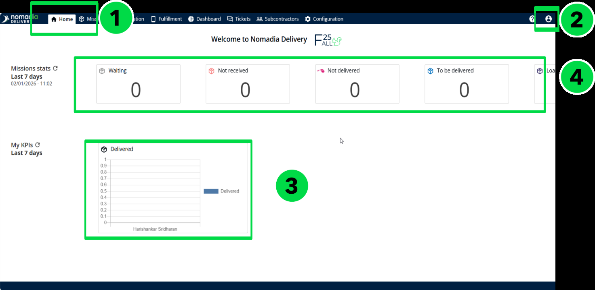
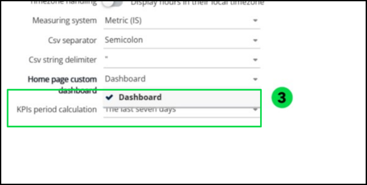
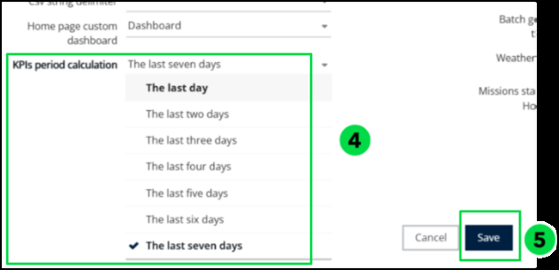
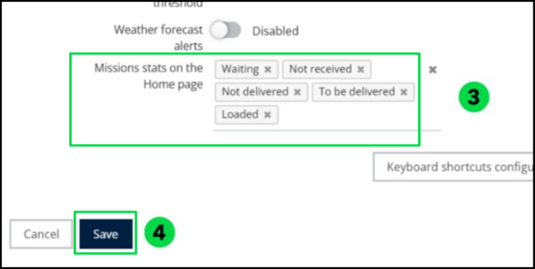
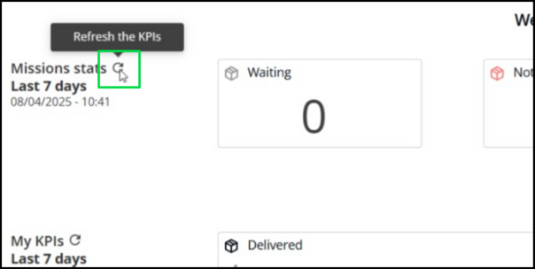

# Home Page

## Understanding the Home Screen

The Home Screen is the default landing page when you access Nomadia Delivery\. It provides an operational overview of your delivery activity, highlighting key performance indicators, mission statuses, and quick links to core functionalities\. This screen is designed to help users navigate efficiently while staying informed about logistics operations in real time\.

__  Key Areas of the Home Screen__

__Code__

__                   Section__

__Purpose__

1

Navigation Tabs

__Access the main parts of the app:__

- __Missions__ – Provides a unified view of all missions with support for planning, tracking, and optimization based on 100\+ constraints\.
- __Dashboard__ – Provides data visualization tools to monitor missions, routes, administrative KPIs, fulfillment KPIs, and other key metrics\.
- __Fulfillment__ – Used for tracking live locations and monitoring mission progress with Proof of Delivery \(PoD\) at the route level
- __Configuration__ – Customize the app to your needs\.

2

User and Help Icons

__Top\-right icons:__

- __Help Me__ – FAQs and documentation\.
- __Account__ – User settings, updates, and logout\.

3

My KPI’s

Users can select a homepage\-compatible dashboard from 'My Preferences' and set it to display on the homepage\.

4

Mission Statistics

Displays mission statuses from the past seven days with up to five KPI categories, customizable via “My Preferences”\.

## Configure the display of my KPI

You can personalize your Home Screen by selecting which KPIs are most relevant to your operations\. Nomadia Delivery allows you to display the configured home page dashboard, along with a configurable calculation period ranging from the last day to the last seven days\. This helps you stay focused on the metrics that matter most\.

From the __Home page__, 

1. Click on the __Account__ icon located in the upper\-right corner of the screen\.
2. Select __My Preferences__ from the dropdown menu\.

1. Choose the __Dashboard__ from the __Home page custom dashboard__\.

1. Select a period ranging from __Last Day__ to __Last Seven Days__ based on your preference\.
2. Click on __Save__

1. Your homepage will display the chosen dashboard\.

## Configure the display of mission’s statuses

This feature allows users to customize the mission statuses displayed on their home page

dashboard\.

By selecting up to five statuses, users can tailor the view to show the most relevant information

Based on their operational needs, helping them stay focused and efficient\.

From the __Home page__, 

1. Click the __Account__ icon located at the top\-right corner of the screen\.
2. From the dropdown menu, select __My Preferences__\.
3. Choose up to five statuses of the __Mission Stats__ on the Home page to display from the   

        following options:

- Waiting
- Not Received
- Not Delivered
- To Be Delivered
- Loaded

1. After selecting the desired statuses, click on __Save__\.

 

1. Your home page will display the selected KPI’s\. 

## Refresh KPI date and Mission statuses

This feature allows users to manually refresh the mission KPIs, and statistics displayed on the home page\. It ensures that the most recent data is retrieved and shown, providing users with up\-to\-date insights into their mission progress and performance\.

From the __Home Page__, 

1. Navigate to the top\-left section of the screen\.
2. Locate the __*Refresh KPIs *__icon positioned next to the Last Updated Date and Time\.
3. Click the __Refresh__ __the KPIs __icon to update the displayed data with the latest available   

      information\.

