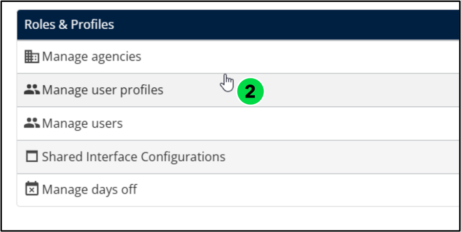
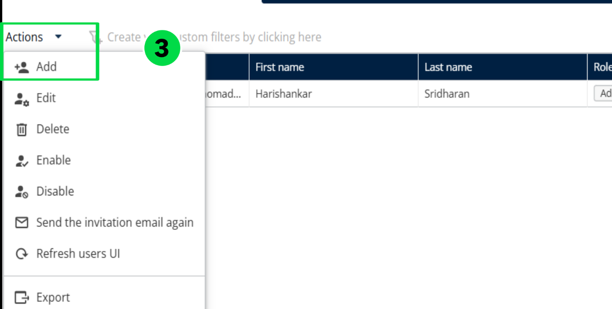
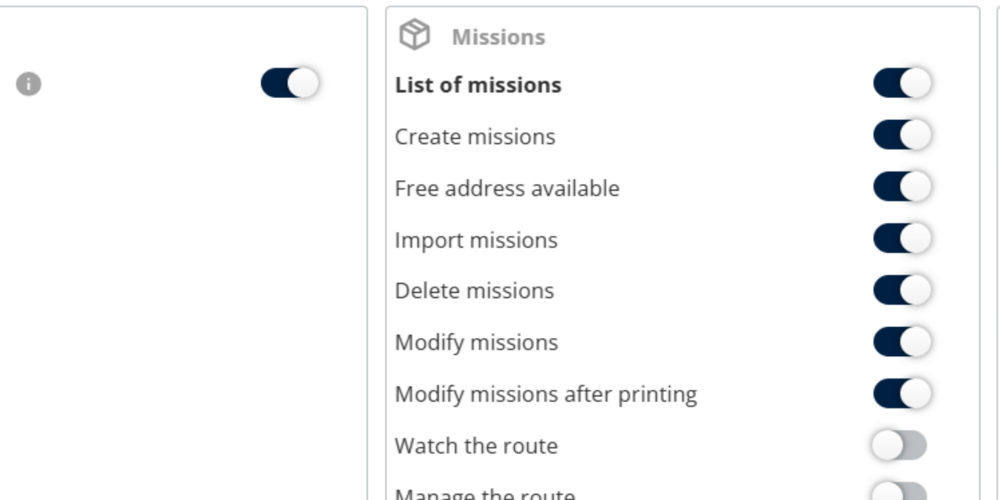
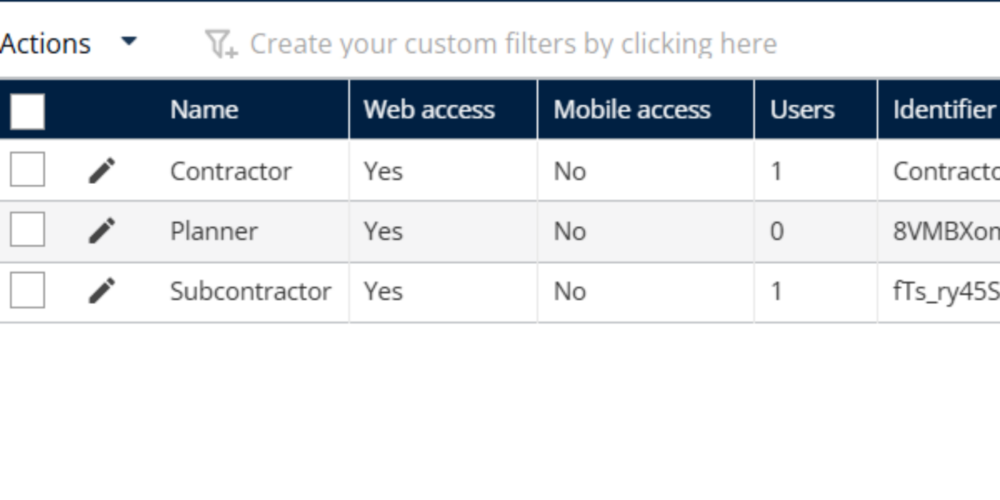

# 4. Manage User Profile

Organizations with hundreds or thousands of users can take advantage of the User Profiles feature to create multiple profiles with different access rights, simplifying user and permission management.

1. Navigate to Configuration

2. From the list, select Manage User Profiles.

<figure><figcaption></figcaption></figure>

2. Click the Actions drop-down and choose Add.

* Enter the Identifier and Profile Name.
*   Enable contractor profiles (Web access) for contractor users and sub-contractor profiles

    for (Web or Mobile) for sub-contractor users.

* Enable the required Roles and Rights.

4. Click Save.

A confirmation message indicates that the user profile has been created successfully.

