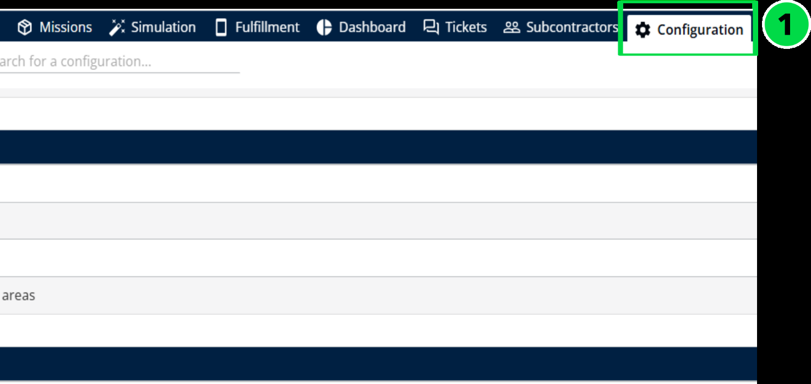
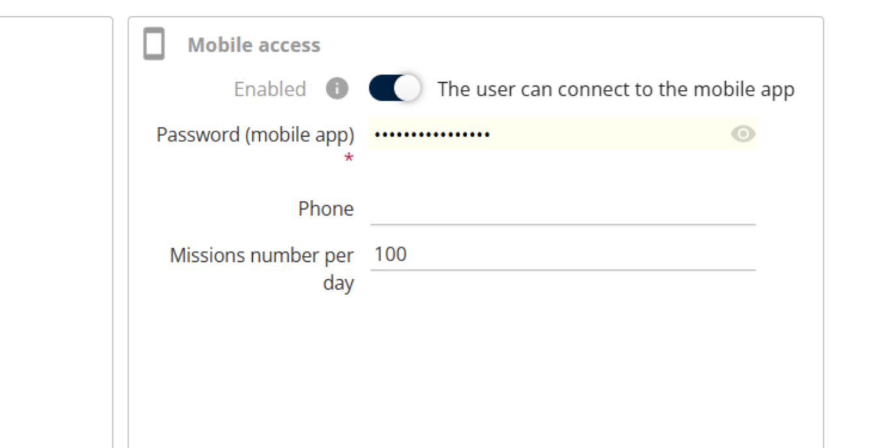
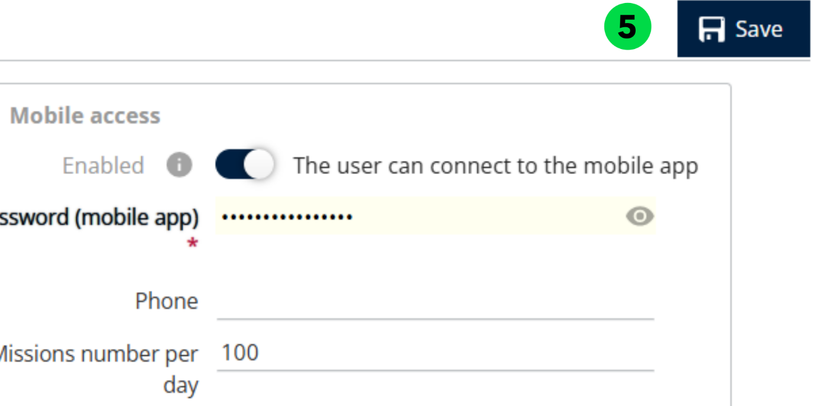
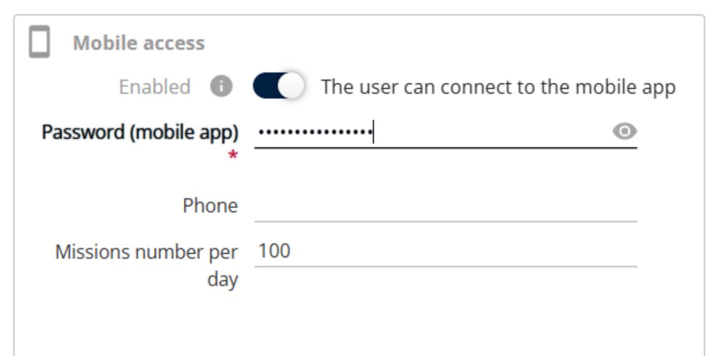
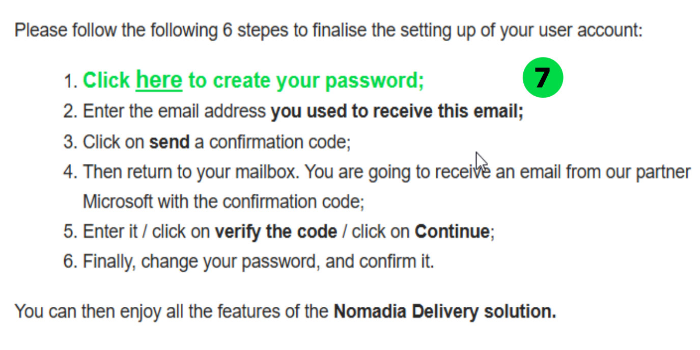
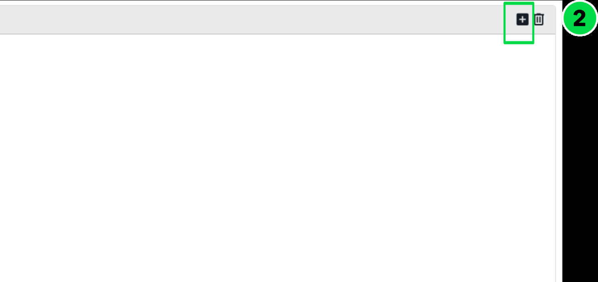

# 5\. Manage Users

The Manage Users section allows administrators to create, configure, and maintain user accounts in Nomadia Delivery\. From this screen, you can add new users, create users based on existing profiles, and manage user access to web and mobile applications\. It also enables you to define user roles and permissions, assign agencies, configure working schedules, manage days off, and control access to key functional areas such as optimization, missions, depots, tickets, and vehicles\. This ensures that each user has the appropriate access rights and availability based on their role and responsibilities within the organization\.

## Enabling Mobile Access

1. Navigate to __Configuration__\.

1. From the list, select __Manage Users__\.

;

1. Click the __Actions __drop\-down and choose __Add__\.

1. To create a new user, set Create from existing user to __No__\. Click __OK__\. For step\-by\-step instructions, refer to section [5\.3\. Creating a User from an Existing User](#_5.3._Creating_a)

- Select the appropriate Profile Name: __Planner__ \(__Standard\)__, __Contractor__, or __Subcontractor__\.
- If Planner \(Standard\) is selected, access can be granted to a Transporter\.
- If Contractor is selected, access can be granted to a Contractor\.
- If Subcontractor is selected, access can be granted to a Subcontractor
- Enter the __Login ID, First Name, and Last Name__\.
- The __Login ID__ is required to be in an email format\. For __Mobile Users__, the login ID is not 

      required to be a valid email address\.

- Set the User Status to __Yes__ or __No__, as required\.
- When a profile is selected, all roles and access rights are inherited automatically\. Roles 

      and rights cannot be enabled or disabled manually at the user level\. To change any roles 

       or access rights, the modifications must be made in the profile configuration\.

- Enable __Mobile Access__ and enter the user’s Password\. For more information about the 

      password policy, refer to the link [5\.1\.2\. Password policy for Mobile Access](#_5.1.2._Password_policy)

- Open __Roles and Rights__ and enable the required permissions:

                 

- Go to __Agency__, select the available agency, and click the right arrow to assign it to the user\.

         

1. After completing all required details, click __Save__ to create the user\. 

### 5\.1\.1\. Roles and Rights

__Roles and Rights__

__Description__

Delivery

When enabled, users can perform delivery\-related operations\.

Docking

When enabled, users can access and manage docking activities

Loading / Unloading

When enabled, users can load and unload parcels in their vehicles\.

Loading when not fully prepared

When enabled, users can load parcels even if the mission is not fully prepared\.

Prepare

When enabled, users can prepare missions before execution\.

Reception

When enabled, users can receive parcels at the destination or depot\.

Storage

When enabled, users can move parcels into storage locations\.

Scan unknown missions

When enabled, users can scan and process missions that are not predefined\.

Create routes

When enabled, users can create and manage delivery routes\.

Handle unassigned deliveries

When enabled, users can manage deliveries not assigned to any route or resource\.

Handle unassigned pickups

When enabled, users can manage pickups not assigned to any route or resource

Reassign missions

When enabled, users can reassign missions to different routes or resources\.

Scan not mandatory

When enabled, scanning parcels is optional during operations\.

Reposition addresses

When enabled, users can modify or correct mission addresses\.

Supervisor screen

When enabled, users can access the supervisor monitoring screen\.

Parcel transfer

When enabled, users can transfer parcels between missions or containers\.

Group into a container

When enabled, users can group multiple parcels into a single container\.

Modify missions

When enabled, users can edit mission details\.

Make the call mandatory

When enabled, users must make a call before completing the mission

### 5\.1\.2\. Password policy for Mobile Access

The password must contain a minimum of __8 characters__, including __at least one uppercase __

__letter__, __one lowercase letter__, and __one number__\.    

   

## Enabling Web Access

1. Navigate to Configuration\.
2. From the list, select Manage Users\.
3. Click the Actions drop\-down and select Add\.
4. To create a new user, set Create from existing user to No, then click OK\.

- Select the appropriate Profile Name: __Planner__ \(__Standard\)__, __Contractor__, or __Subcontractor__\.
- If Planner \(Standard\) is selected, access can be granted to a Transporter\.
- If Contractor is selected, access can be granted to a Contractor\.
- If Subcontractor is selected, access can be granted to a Subcontractor
- Enter the __Login ID, First Name, and Last Name__\.
- For __Web Users,__ the __Login ID__ must be in an email format and must be a valid email 

     address\.

- Set the User Status to __Yes__ or __No__, as required
- When a profile is selected, all roles and access rights are inherited automatically\. Roles 

      and rights cannot be enabled or disabled manually at the user level\. To change any roles     

      or access rights, the modifications must be made in the profile configuration\.

1. Enable or disable Web Access as required and select the Subcontractor Name, if  

     applicable\.

1. Click Save\. A notification email is sent to the user\.

1. Open the email and click the provided link to set the password\.

1. Enter your email address and click Send verification code\.

1. Enter the received verification code and click Verify code\.

1. Click Continue\.

1. Enter the new password and confirm it\. For more information about the password policy, refer to the link [5\.2\.2\. Password policy for Web Access](#_5.2.2._Password_policy)
2. Click Continue\.

The password has been changed successfully\.

### 

### 5\.2\.1\. Roles and Rights

Roles and Rights

Description

Administration

When enabled, users can access administrative configuration features\.

Manage articles

When enabled, users can create, update, and manage articles\.

Missions

When enabled, users can access mission\-related functionalities\.

List of missions

When enabled, users can view the list of all missions\.

Create missions

When enabled, users can create new missions\.

Free address available

When enabled, users can create missions without selecting a predefined address\.

Import missions

When enabled, users can import missions in bulk\.

Delete missions

When enabled, users can delete existing missions\.

Modify missions

When enabled, users can edit mission details\.

Modify missions after printing

When enabled, users can modify missions even after they have been printed\.

Watch the route

When enabled, users can view route details and progress\.

Manage the route

When enabled, users can create, edit, and manage routes\.

Customize display parameters

When enabled, users can customize mission display settings\.

Tickets

When enabled, users can access ticket management features\.

See the tickets list

When enabled, users can view the list of tickets\.

Answer to tickets

When enabled, users can respond to tickets\.

Optimization

When enabled, users can access optimization features\.

Schedule

When enabled, users can create and manage optimized schedules\.

See other people's simulations

When enabled, users can view simulations created by other users

Edit other people's simulations

When enabled, users can modify simulations created by other users\.

Modify optimization settings

When enabled, users can configure optimization parameters\.

Depot

When enabled, users can access depot\-related features\.

Manage the depots

When enabled, users can create, update, and manage depots\.

Vehicles

When enabled, users can access vehicle management features\.

Manage the vehicles

When enabled, users can create, update, and manage vehicles\.

Customize the view of fleets and vehicles

When enabled, users can customize fleet and vehicle constraints\.

Fulfillment

When enabled, users can access fulfillment features\.

Fulfillment follow up

When enabled, users can track fulfillment progress and status\.

See other people's schedules

When enabled, users can view schedules created by other users

Contractors

When enabled, users can access contractor management features\.

List of contractors

When enabled, users can view the list of contractors\.

Create contractors

When enabled, users can create new contractors\.

Import contractors

When enabled, users can import contractors in bulk\.

Delete contractors

When enabled, users can delete contractors\.

Modify contractors

When enabled, users can edit contractor details\.

Address list

When enabled, users can access address management features\.

Address list

When enabled, users can view the list of addresses\.

Create addresses

When enabled, users can create new addresses\.

Import addresses

When enabled, users can import addresses in bulk\.

Delete addresses

When enabled, users can delete addresses\.

Modify addresses

When enabled, users can edit address details\.

Subcontractors

When enabled, users can access subcontractor management features\.

List of subcontractors

When enabled, users can view the list of subcontractors\.

Create subcontractors

When enabled, users can create new subcontractors\.

Update subcontractors

When enabled, users can update subcontractor details\.

Delete subcontractors

When enabled, users can delete subcontractors\.

Import subcontractors

When enabled, users can import subcontractors in bulk\.

List of subcontractor’s schedule

When enabled, users can view subcontractors’ schedules\.

List of subcontractors vehicles

When enabled, users can view subcontractors’ vehicles\.

Dashboard and KPIs

When enabled, users can access dashboards and KPIs\.

View dashboards

When enabled, users can view dashboards and KPI data\.

Modify dashboards

When enabled, users can create and modify dashboards\.

### 5\.2\.2\. Password policy for Web Access

The password must include at least three of the following character types:

- Lowercase letters \(a–z\)
- Uppercase letters \(A–Z\)
- Numbers \(0–9\)
- Symbols \(special characters\)

 

## 5\.3\. Creating a User from an Existing User

1. In __Manage Users__, click the __Actions__ drop\-down and select __Add__\.
2. Set Create from existing user to __Yes__\.
3. Select the existing user from the list\.
4. Choose __Yes__ or __No__ for Import User’s Preferences, as required\.
5. Click __Ok__

    

1. Modify the user details if necessary\.

1. Click __Save__ to complete the process\.

## 5\.4\. Days off

If a user has planned leave or vacation, the Days Off section can be used to record the unavailable dates\.

1. Navigate to __Days Off\.__

__       __

1. Click the __\+__ \(Add\) icon\.

1. Enter the __From Date, To Date__, and specify the __Reason__\.
2. Click __Add__\.

1. Click on __Save__ to update the details

