# 4. Manage Users

The Manage Users section allows administrators to create, configure, and maintain user accounts in Nomadia Delivery. From this screen, you can add new users, create users based on existing profiles, and manage user access to web and mobile applications. It also enables you to define user roles and permissions, assign agencies, configure working schedules, manage days off, and control access to key functional areas such as optimization, missions, depots, tickets, and vehicles. This ensures that each user has the appropriate access rights and availability based on their role and responsibilities within the organization.

### 1. Enabling Mobile Access 

1. Navigate to **Configuration**.

2. From the list, select **Manage Users**.

<figure><figcaption></figcaption></figure>

3. Click the \_\_Actions \_\_drop-down and choose **Add**.

4. To create a new user, set Create from existing user to **No**. Click **OK**. For step-by-step instructions, refer to section [5.3. Creating a User from an Existing User](manage_users.md#_5.3._Creating_a)

* Select the appropriate Profile Name: **Planner** (**Standard)**, **Contractor**, or **Subcontractor**.
* If Planner (Standard) is selected, access can be granted to a Transporter.
* If Contractor is selected, access can be granted to a Contractor.
* If Subcontractor is selected, access can be granted to a Subcontractor
* Enter the **Login ID, First Name, and Last Name**.
* The **Login ID** is required to be in an email format. For **Mobile Users**, the login ID is not required to be a valid email address\\.

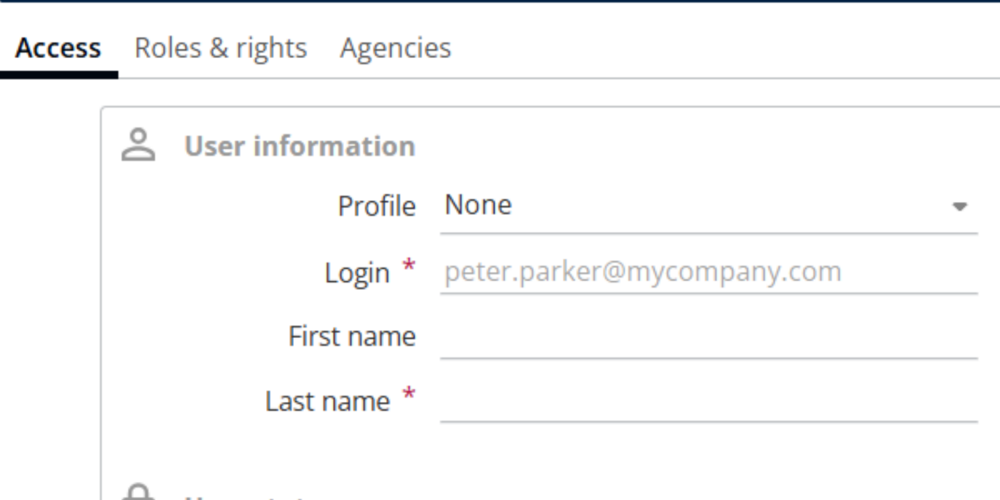

* Set the User Status to **Yes** or **No**, as required.
* When a profile is selected, all roles and access rights are inherited automatically. Roles and rights cannot be enabled or disabled manually at the user level\\. To change any roles or access rights, the modifications must be made in the profile configuration\\.
* Enable **Mobile Access** and enter the user’s Password. For more information about the password policy, refer to the link \[5\\.1\\.2\\. Password policy for Mobile Access]\(#\_5.1.2.\_Password\_policy)

* Open **Roles and Rights** and enable the required permissions:

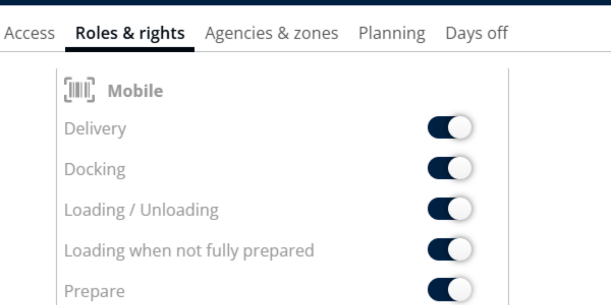

* Go to **Agency**, select the available agency, and click the right arrow to assign it to the user.

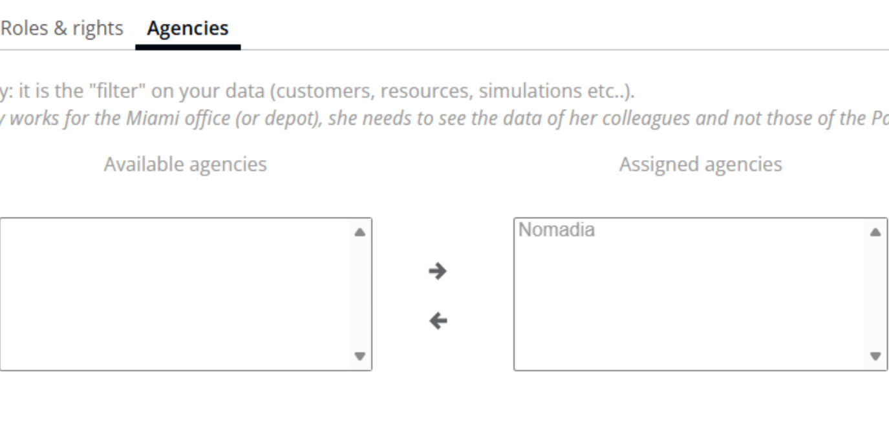

5. After completing all required details, click **Save** to create the user.

#### 1.1. Roles and Rights 

**Delivery**: When enabled, users can perform delivery-related operations.

**Docking**: When enabled, users can access and manage docking activities

**Loading / Unloading**: When enabled, users can load and unload parcels in their vehicles.

**Loading when not fully prepared**: When enabled, users can load parcels even if the mission is not fully prepared.

**Prepare**: When enabled, users can prepare missions before execution.

**Reception**: When enabled, users can receive parcels at the destination or depot.

**Storage**: When enabled, users can move parcels into storage locations.

**Scan unknown missions**: When enabled, users can scan and process missions that are not predefined.

**Create routes**: When enabled, users can create and manage delivery routes.

**Handle unassigned deliveries**: When enabled, users can manage deliveries not assigned to any route or resource.

**Handle unassigned pickups**: When enabled, users can manage pickups not assigned to any route or resource

**Reassign missions**: When enabled, users can reassign missions to different routes or resources.

**Scan not mandatory**: When enabled, scanning parcels is optional during operations.

**Reposition addresses**: When enabled, users can modify or correct mission addresses.

**Supervisor screen**: When enabled, users can access the supervisor monitoring screen.

**Parcel transfer**: When enabled, users can transfer parcels between missions or containers.

**Group into a container**: When enabled, users can group multiple parcels into a single container.

**Modify missions**: When enabled, users can edit mission details.

**Make the call mandatory**: When enabled, users must make a call before completing the mission

#### 1.2. Password policy for Mobile Access 

The password must contain a minimum of **8 characters**, including \_\_at least one uppercase \_\_

**letter**, **one lowercase letter**, and **one number**.

### **2. Enabling Web Access** 

1. Navigate to Configuration.
2. From the list, select Manage Users.
3. Click the Actions drop-down and select Add.
4.  To create a new user, set Create from existing user to No, then click OK.

    * If Planner (Standard) is selected, access can be granted to a Transporter.
    * If Contractor is selected, access can be granted to a Contractor.
    * If Subcontractor is selected, access can be granted to a Subcontractor
    * Enter the Login ID, First Name, and Last Name.
    * For Web Users, the Login ID must be in an email format and must be a valid email address

    <figure><figcaption></figcaption></figure>

    * Set the User Status to Yes or No, as required
    * When a profile is selected, all roles and access rights are inherited automatically. Roles and rights cannot be enabled or disabled manually at the user level\\. To change any roles or access rights, the modifications must be made in the profile configuration\\.
5. Enable or disable Web Access as required and select the Subcontractor Name, if applicable.

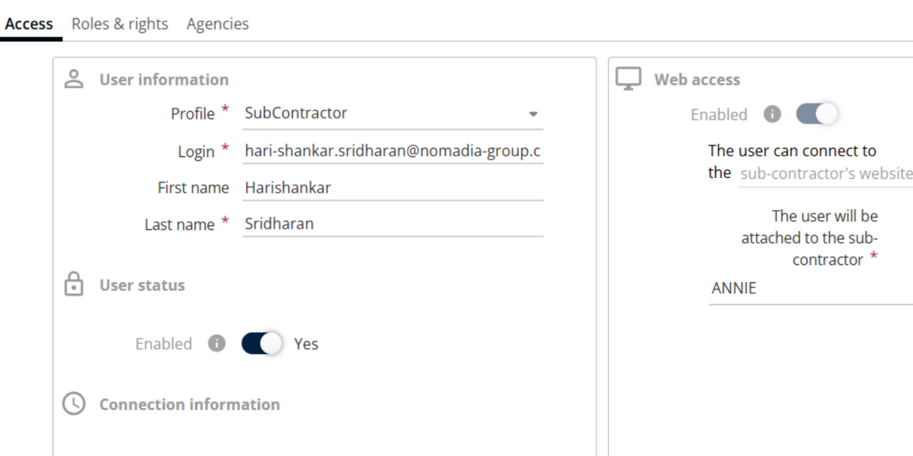

6. Click Save. A notification email is sent to the user.

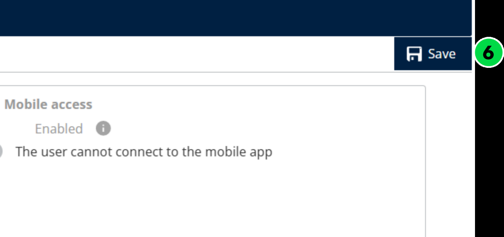

7. Open the email and click the provided link to set the password.

8. Enter your email address and click Send verification code.

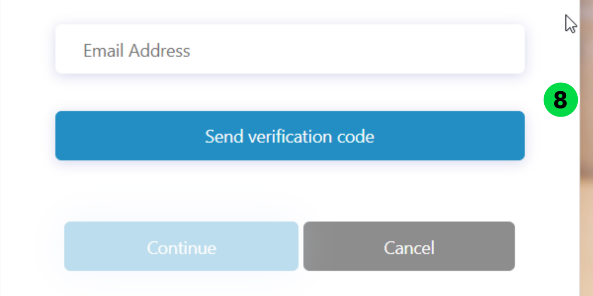

9. Enter the received verification code and click Verify code.

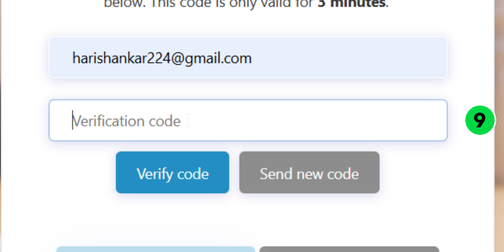

10. Click Continue.

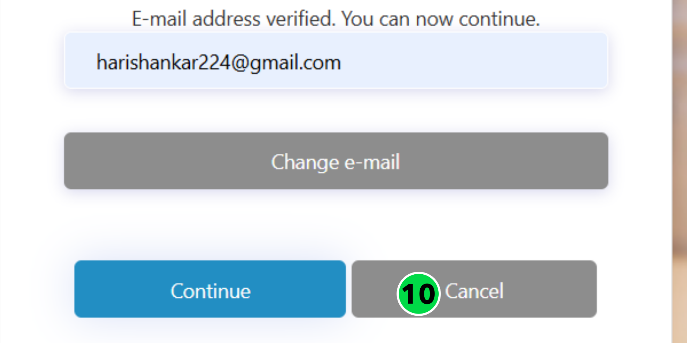

11. Enter the new password and confirm it. For more information about the password policy, refer to the link [5.2.2. Password policy for Web Access](manage_users.md#_5.2.2._Password_policy)
12. Click Continue.

The password has been changed successfully.

#### 2.1. Roles and Rights

**Administration**: When enabled, users can access administrative configuration features.

**Manage articles**: When enabled, users can create, update, and manage articles.

**Missions**: When enabled, users can access mission-related functionalities.

**List of missions**: When enabled, users can view the list of all missions.

**Create missions**: When enabled, users can create new missions.

**Free address available**: When enabled, users can create missions without selecting a predefined address.

**Import missions**: When enabled, users can import missions in bulk.

**Delete missions**: When enabled, users can delete existing missions.

**Modify missions**: When enabled, users can edit mission details.

**Modify missions after printing**: When enabled, users can modify missions even after they have been printed.

**Watch the route**: When enabled, users can view route details and progress.

**Manage the route**: When enabled, users can create, edit, and manage routes.

**Customize display parameters**: When enabled, users can customize mission display settings.

**Tickets**: When enabled, users can access ticket management features.

**See the tickets list**: When enabled, users can view the list of tickets.

**Answer to tickets**: When enabled, users can respond to tickets.

**Optimization**: When enabled, users can access optimization features.

**Schedule**: When enabled, users can create and manage optimized schedules.

**See other people's simulations**: When enabled, users can view simulations created by other users

**Edit other people's simulations**: When enabled, users can modify simulations created by other users.

**Modify optimization settings**: When enabled, users can configure optimization parameters.

**Depot**: When enabled, users can access depot-related features.

**Manage the depots**: When enabled, users can create, update, and manage depots.

**Vehicles**: When enabled, users can access vehicle management features.

**Manage the vehicles**: When enabled, users can create, update, and manage vehicles.

**Customize the view of fleets and vehicles**: When enabled, users can customize fleet and vehicle constraints.

**Fulfillment**: When enabled, users can access fulfillment features.

**Fulfillment follow up**: When enabled, users can track fulfillment progress and status.

**See other people's schedules**: When enabled, users can view schedules created by other users

**Contractors**: When enabled, users can access contractor management features.

**List of contractors**: When enabled, users can view the list of contractors.

**Create contractors**: When enabled, users can create new contractors.

**Import contractors**: When enabled, users can import contractors in bulk.

**Delete contractors**: When enabled, users can delete contractors.

**Modify contractors**: When enabled, users can edit contractor details.

**Address list**: When enabled, users can access address management features.

**Address list**: When enabled, users can view the list of addresses.

**Create addresses**: When enabled, users can create new addresses.

**Import addresses**: When enabled, users can import addresses in bulk.

**Delete addresses**: When enabled, users can delete addresses.

**Modify addresses**: When enabled, users can edit address details.

**Subcontractors**: When enabled, users can access subcontractor management features.

**List of subcontractors**: When enabled, users can view the list of subcontractors.

**Create subcontractors**: When enabled, users can create new subcontractors.

**Update subcontractors**: When enabled, users can update subcontractor details.

**Delete subcontractors**: When enabled, users can delete subcontractors.

**Import subcontractors**: When enabled, users can import subcontractors in bulk.

**List of subcontractor’s schedule**: When enabled, users can view subcontractors’ schedules.

**List of subcontractors vehicles**: When enabled, users can view subcontractors’ vehicles.

**Dashboard and KPIs**: When enabled, users can access dashboards and KPIs.

**View dashboards**: When enabled, users can view dashboards and KPI data.

**Modify dashboards**: When enabled, users can create and modify dashboards.

#### 2.2. Password policy for Web Access 

The password must include at least three of the following character types:

* Lowercase letters (a–z)
* Uppercase letters (A–Z)
* Numbers (0–9)
* Symbols (special characters)

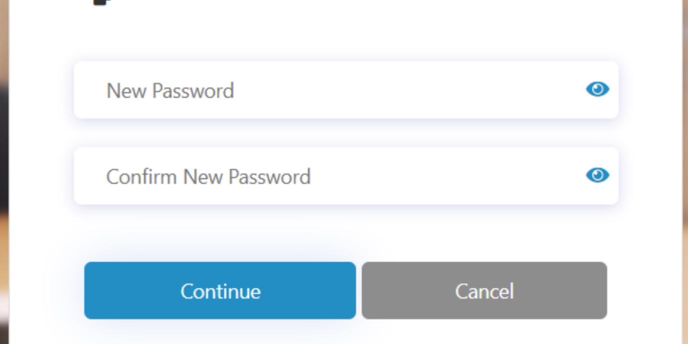

### 3. Creating a User from an Existing User 

1. In **Manage Users**, click the **Actions** drop-down and select **Add**.
2. Set Create from existing user to **Yes**.
3. Select the existing user from the list.
4. Choose **Yes** or **No** for Import User’s Preferences, as required.
5. Click **Ok**

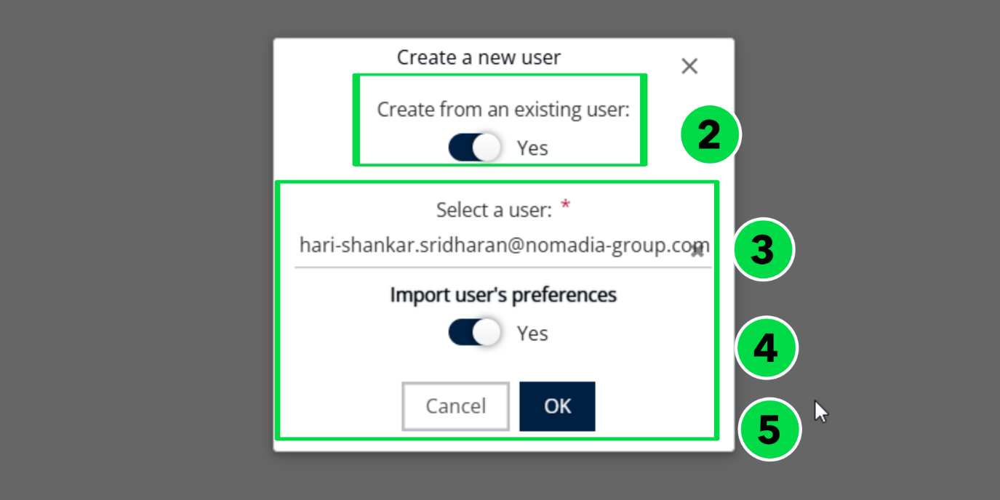

1. Modify the user details if necessary.

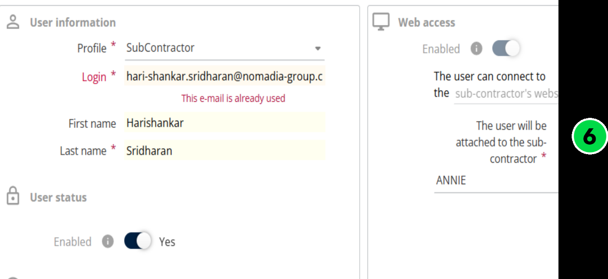

2. Click **Save** to complete the process.

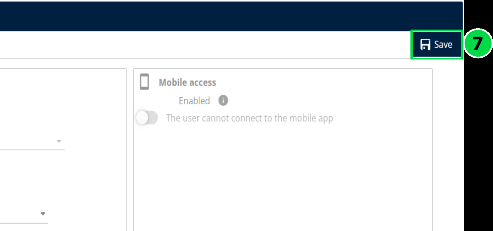

### 4. Days off 

If a user has planned leave or vacation, the Days Off section can be used to record the unavailable dates.

1. Navigate to **Days Off.**

***

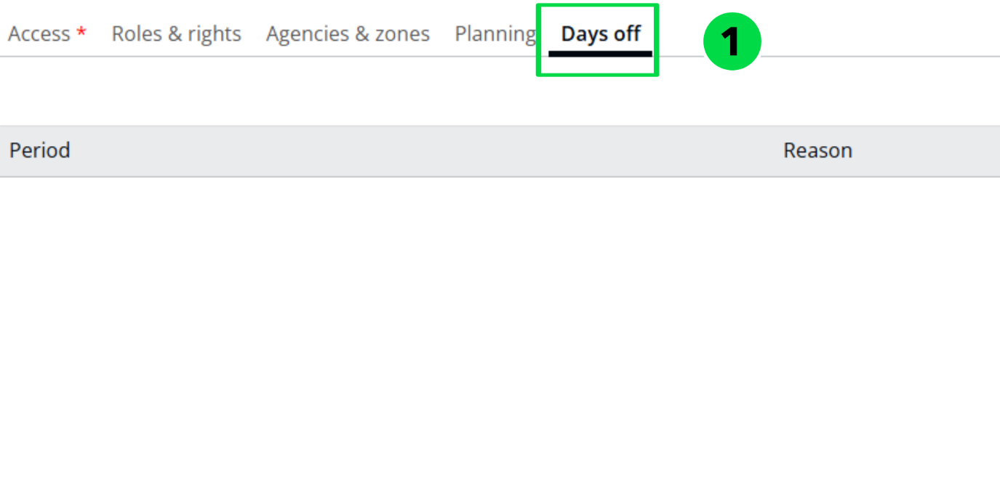

2. Click the **+** (Add) icon.

3. Enter the **From Date, To Date**, and specify the **Reason**.
4. Click **Add**.

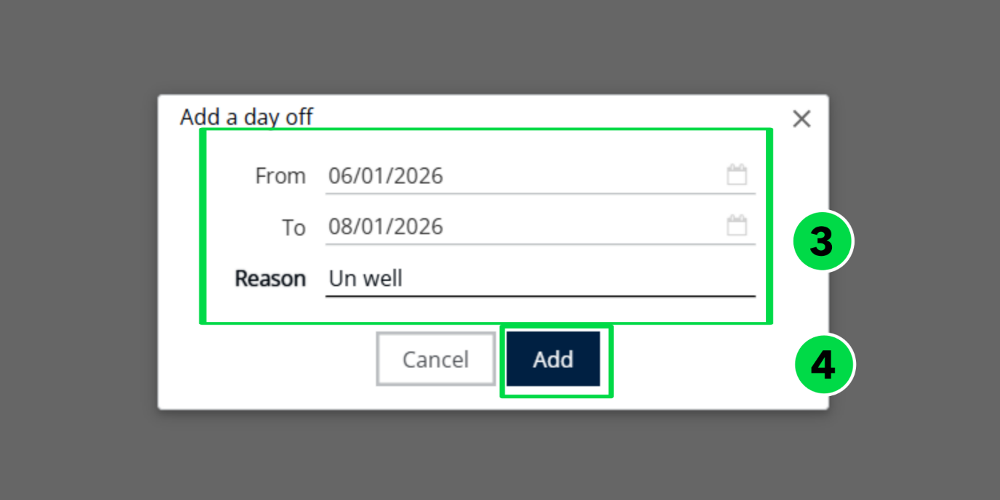

5. Click on **Save** to update the details

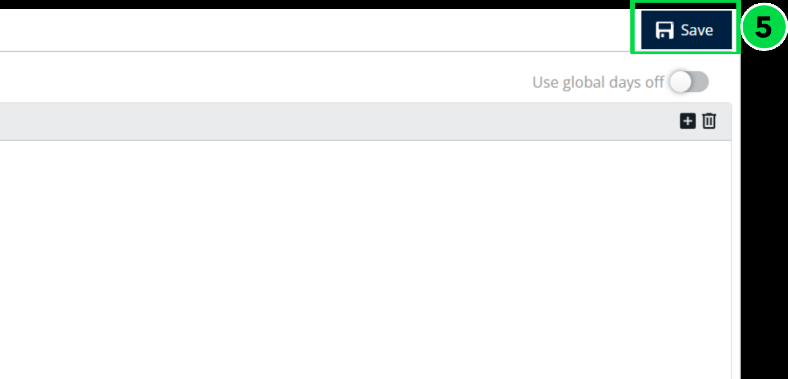
