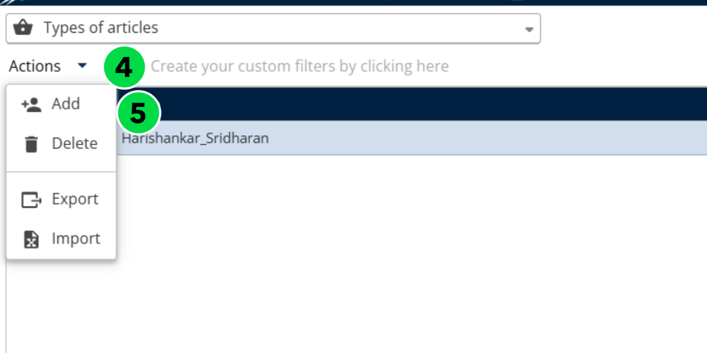
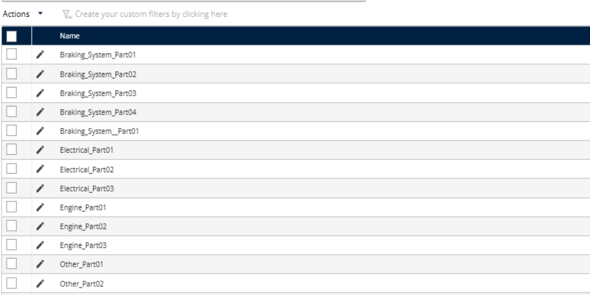
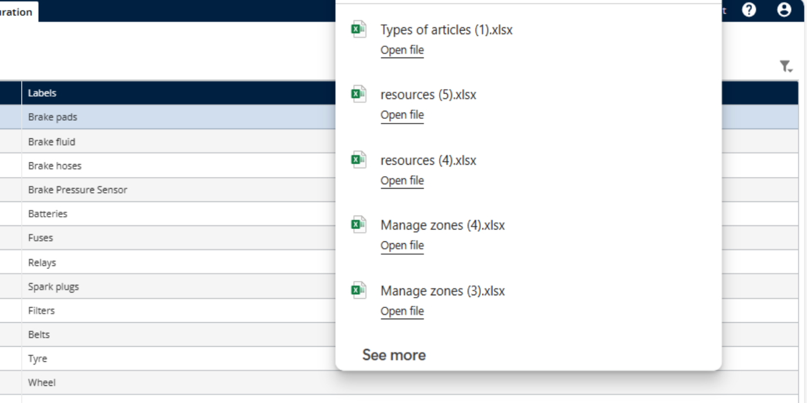
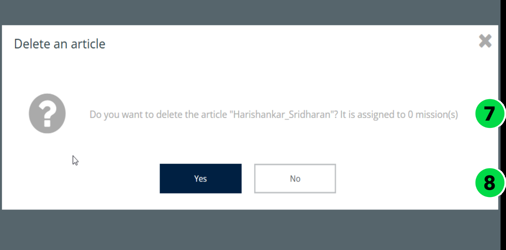
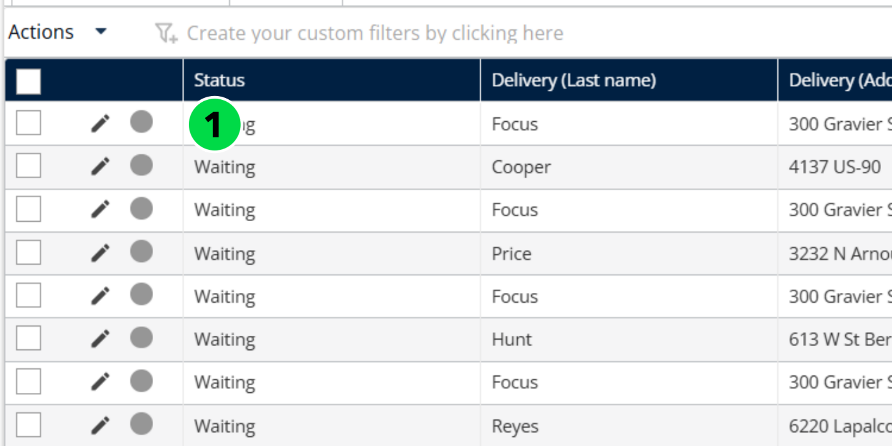
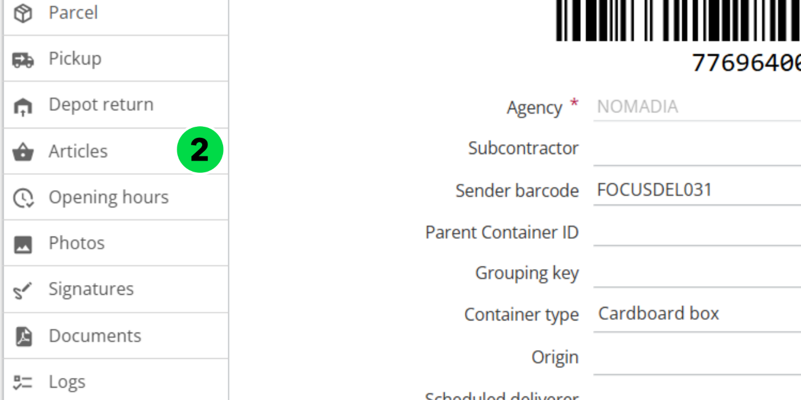

### 6\.3\.4\. Manage Articles

The Manage Articles feature in Nomadia Delivery allows users to maintain and organize a centralized catalog of products \(articles\) that are part of the delivery workflow\. This feature supports the complete lifecycle of articles — including creation, editing, activation/deactivation, and deletion — enabling seamless tracking and accurate planning of deliveries\.

### 6\.3\.4\.1\. Manage Article types

The Manage Article Types feature allows administrators to define and categorize the various kinds of articles handled within the delivery process\. This classification ensures better organization, filtering, and reporting of items during route planning, loading, and delivery execution\.

__Field name in import file__

__Field name in back office table__

__Description__

Id

Name

Mandatory and unique among all the articles id / Name

Labels

Labels

In the import file, for several languages the syntax is:

\[language code on two characters\] = \[Translation\]; \[language code on two characters\] = \[Translation\]\. E\.g\.: “fr=Tournevis;en=Screwdriver”

### 6\.3\.4\.1\.1\. Import Article types\. 

1. Go to __Configuration__\.
2. Click on __Configuration Menu__
3. Under __Customization__, click on __Types of Articles__\.

1. Click the __Actions__ dropdown menu
2. Click on __Import__

1. Click on __Browse File__ to upload the file that contains the zone data\.

1. Select a __valid file__ from your local system\.

1. The articles have been imported successfully\. 

### 6\.3\.4\.1\.2\. Create an Article type 

1. Go to __Configuration__\.
2. Click on __Configuration Menu__
3. Under __Customization__, click on __Types of Articles__\.
4. Click the __Actions__ dropdown menu
5. Click on __Add__

1. Enter the__ Name __and__ Translation__

 

1. Click on__ Save__

1. The article type has been created successfully

### 6\.3\.4\.1\.3\. Edit an Article type 

1. Go to __Configuration__\.
2. Click on __Configuration Menu__
3. Under __Customization__, click on __Types of Articles__\.
4. Select an __Article__
5. Click the __Pencil icon__

1. Edit the information as needed

1. Click on __Save__

### 6\.3\.4\.1\.4\. Export Article types

1. Go to __Configuration__\.
2. Click on __Configuration Menu__
3. Under __Customization__, click on __Types of Articles__\.
4. Select an __Article__
5. Click the __Actions__ dropdown menu
6. Click on __Export__

1. The article types have been exported successfully

### 6\.3\.4\.1\.5\. Delete an article type

1. Go to __Configuration__\.
2. Click on __Configuration Menu__
3. Under __Customization__, click on __Types of Articles__\.
4. Select an __Article__
5. Click the __Actions__ dropdown menu
6. Click on __Delete__

1. You will see a confirmation pop\-up message stating: "__Do you want to delete the article?"__
2. Click on__ Delete__

1. The article types have been deleted successfully

### 6\.3\.4\.2\. Add Articles to a Mission

From the __Mission page__

1. Click on __Actions__
2. Select __Add__ from the dropdown menu\. 

1. Click on __Articles__
2. Click on __Add Articles__

1. Enter the required information, including the __Article name__ and __Planned quantity__

1. Click on __Add__

1. The Articles will be added successfully\. 

### 6\.3\.4\.3\. Edit a Mission Article

From the __Mission page__

1. Click the __pencil__ icon of the chosen mission 

1. In the left\-hand menu, click the __Articles__ tab

1. Edit the __Article__

1. Update the necessary details such as __Planned__, __Done__, and __Returned__ quantities
2. Click on __Save__

### 6\.3\.4\.4\. Delete a Mission Article

From the __Mission page__

1. Click the __pencil__ icon next to the desired mission
2. In the left\-hand menu, select the __Articles__ tab
3. Click on the __Bin__ icon of the Article to delete

1. Mission articles will be deleted successfully\. 

