## 7\.1\. Manage Postal Zones

The Manage Postal Zones feature allows administrators and logistics managers to define and manage geographical delivery zones based on postal codes\. These zones are 

essential for organizing deliveries, assigning resources, and optimizing routes within specific areas

### 1\. Import Postal Zones

__Field name in import file__

__Field name in back\-office table__

__Description__

Id

Code

Mandatory\. It should be unique among the other Zone ids

Name

Name

Mandatory

Organization

Agency

Mandatory

Postal Codes

Postal Codes

Normalized Size

Postal Codes normalized length

Normalize With

Prefix

All Skills Required

Require all skills to be compatible

Skills

N/A

Status Customization Types

N/A

Wkt Geometry

N/A

Opening Days

Opening day x

Suffix x is equal from 1 to 10

Opening Hours

Opening Hours x

Suffix x is equal from 1 to 10

1. Click on __Configuration Tab__

1. Click on __Configuration __Menu
2. Under __My data__ section, click on Manage Zones

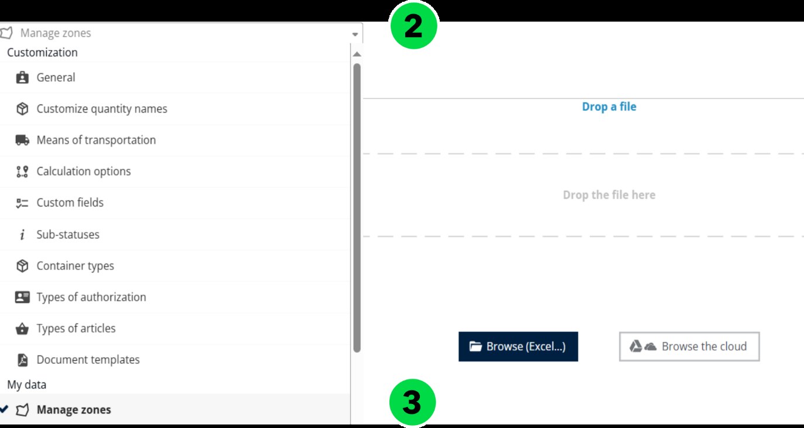

1. Click the __Actions__ dropdown menu\.
2. Click on __Import__

1. Click on __Browse File__ to upload the file that contains the zone data\.

1. Select a valid __Zone file__ from your local system\.

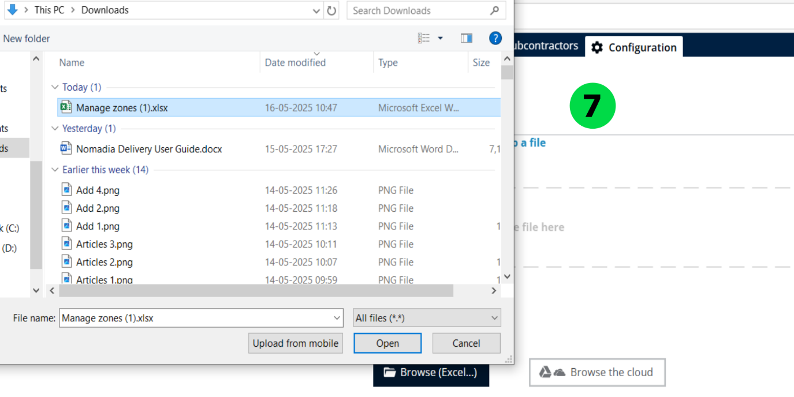

1. Postal Zones will be imported successfully\.

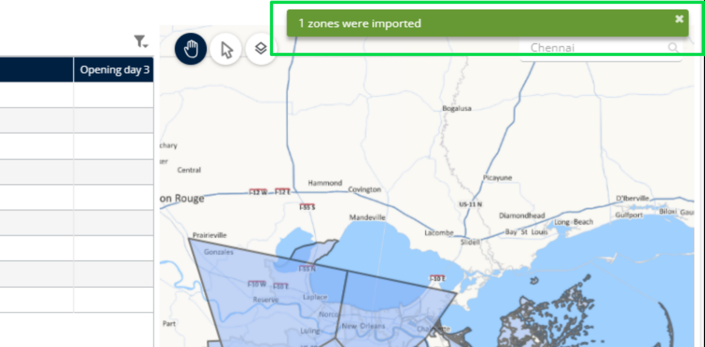

### 6\.3\.1\.2\. Add a Postal Zone

1. Click on __Configuration Tab__
2. Click on __Configuration Menu__
3. Under My data section, click on __Manage Zones__
4. Click the __Actions__ dropdown menu\.
5. Click on __Add a Postal Zone\.__

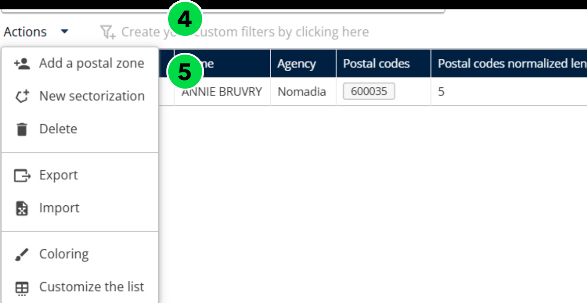

1. Fill in the required fields: __Code__, __Name__, and __Prefix__\.

__Note__: The Prefix is used to standardize postal codes to a fixed length of 6 digits\. In regions where postal codes are shorter \(e\.g\., 5 digits in some areas of France\), the system automatically adds the defined prefix to reach the required length\.

1. Click on __Save__

1. Postal Zones will be added successfully

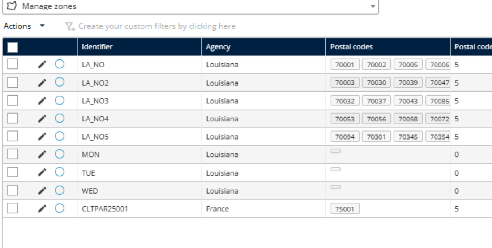

###      6\.3\.1\.3\. Create Postal Zones by Territory Management \(Sectorization\)

1. Click on __Configuration Tab__
2. Click on __Configuration Menu__
3. Under My data section, click on __Manage Zones__
4. Select a __Mission__
5. Click the __Actions__ dropdown menu\.
6. Click on __New Sectorization\. __

For detailed information, refer to the Territory Manager Manual available at the following link:

[https://mynomadia\.com/doc/tm/docs/en/tm\-book/\_districting\.html](https://mynomadia.com/doc/tm/docs/en/tm-book/_districting.html)

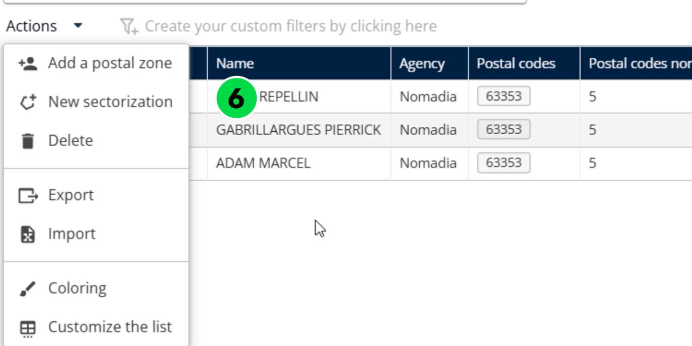

1. Select the appropriate __Indicators__ and define the __Time Period__ 
2. Click on __Assign Territories__

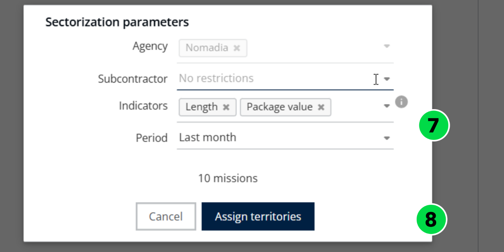

1. Click on __Automation__

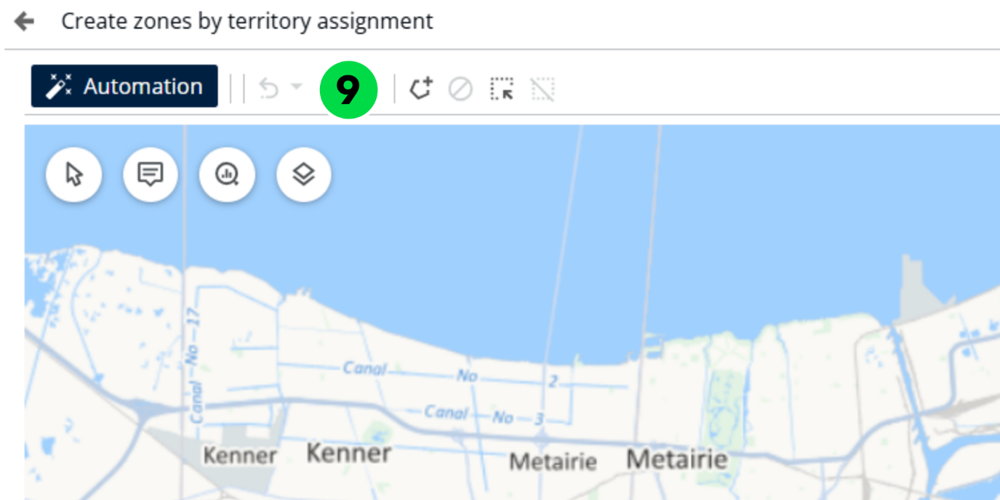

1. In the __Balancing Points__ section, click __Start__ to prepare the system for  

   automatic balancing\.

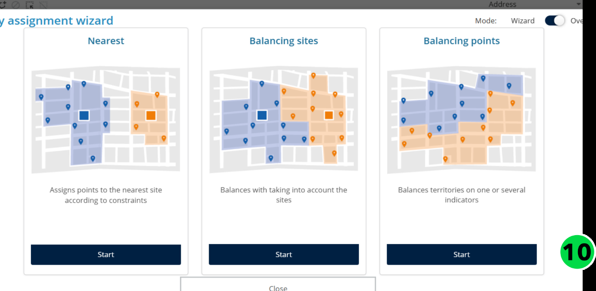

1. Click __“Let’s go\!”__ to launch the automated balancing of territories\.

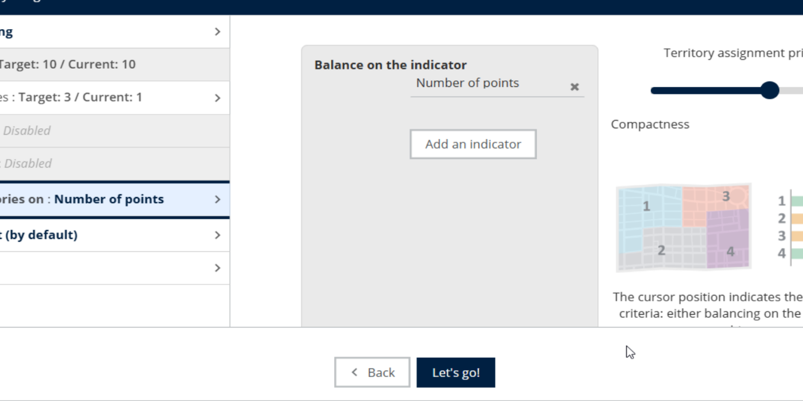

1. Sectors are generated according to the balancing rules set by the user\.
2. To ensure the sectorization respects postal code boundaries, click on __Administrative Borders__ and select __Postal Code__ from the dropdown menu\.  

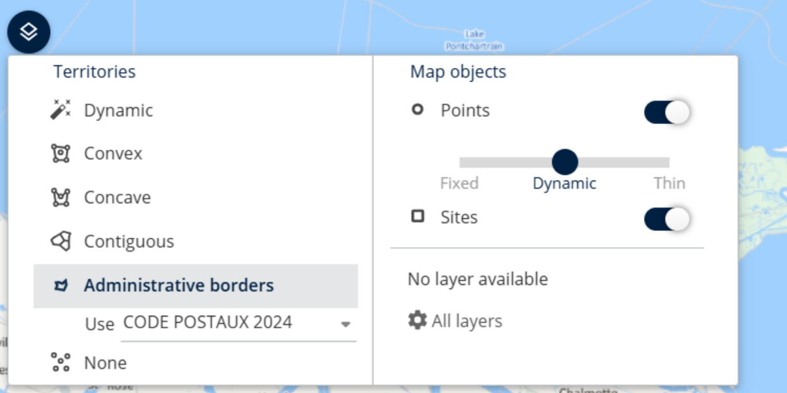

Sectors are aligned based on postal boundaries

__Disclaimer: __Postal code boundary data is unavailable for certain countries__\.__

### 6\.3\.1\.4\. Delete a Postal Zone

1. Click on __Configuration Tab__
2. Click on __Configuration Menu__
3. Under My data section, click on __Manage Zones__
4. Select a __Zone__

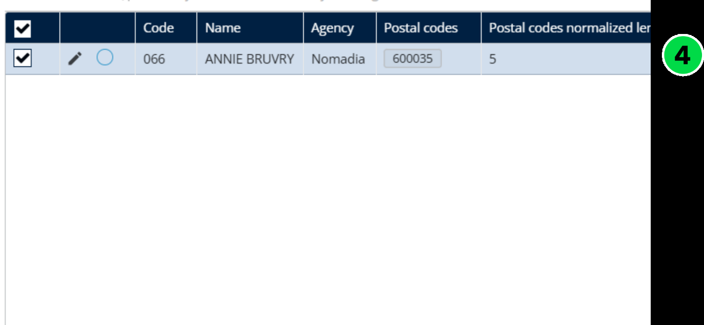

1. Click the __Actions__ dropdown menu\.
2. Click on __Delete__

1. You will see a confirmation pop\-up message stating: "__Are you sure you want to  __

__      delete this zone?"__

1. Click on __Yes__

1. Postal Zone will be deleted successfully

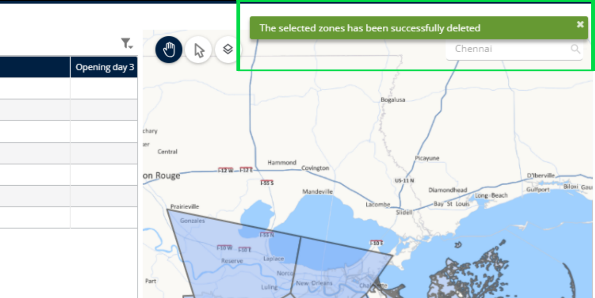

### 6\.3\.1\.5\. Export a Postal Zone

1. Click on __Configuration Tab__
2. Click on __Configuration Menu__
3. Under My data section, click on __Manage Zones__
4. Select a __Zone__
5. Click the __Actions__ dropdown menu\.
6. Click on __Export__

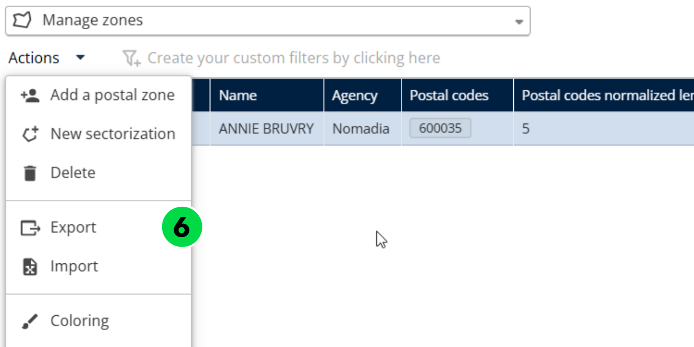

1. Postal Zone will be exported successfully

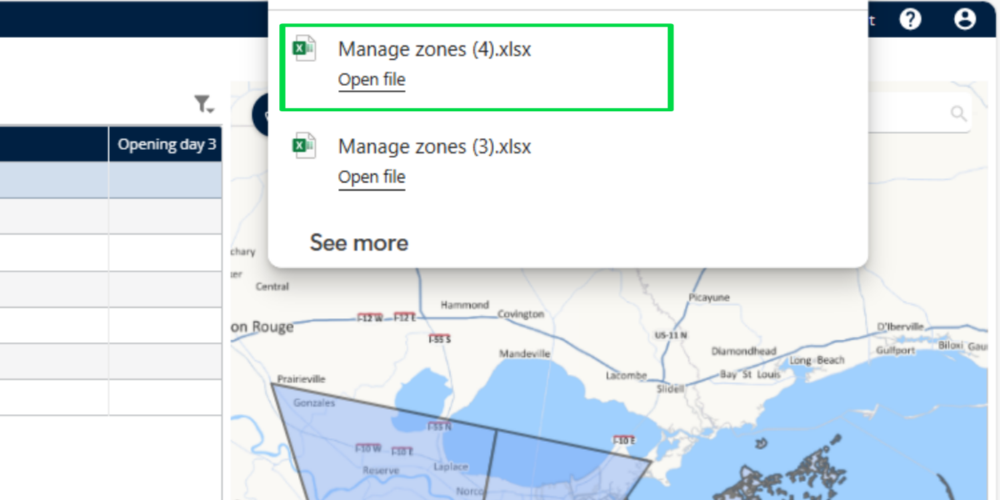

### 6\.3\.1\.6\. Color a Postal Zone

Apply conditions based on zone attributes such as type of mission \(Delivery, Pickup\), Zone priority, Assigned deliverer, Postal code prefix, etc\.

1. Click on __Configuration Tab__
2. Click on __Configuration Menu__
3. Under My data section, click on __Manage Zones__
4. Select a __Zone__
5. Click the __Actions__ dropdown menu\.
6. Click on __Coloring__

1. Choose a__ Color__
2. Click on __Save__

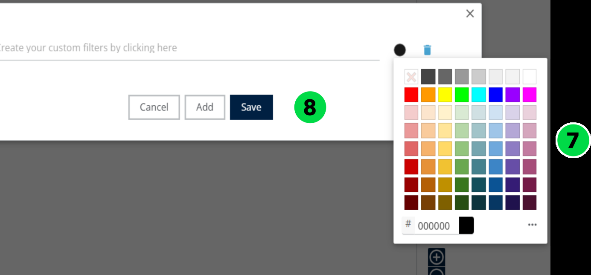

1. The selected color has been applied successfully\. 

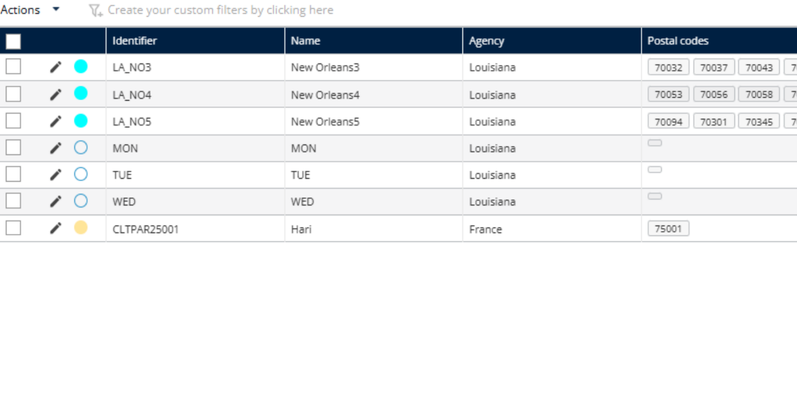

### 6\.3\.1\.7\. Customize Zones Table

   Refer to [4\.3\.1\.1\. Import a Postal Zones](#_4.3.1.1._Import_a) to have the complete list of available fields\.

1. Click on __Configuration Tab__
2. Click on __Configuration Menu__
3. Under My data section, click on __Manage Zones__
4. Select a __Zone__
5. Click the __Actions__ dropdown menu\.
6. Click on __Customize Limit__

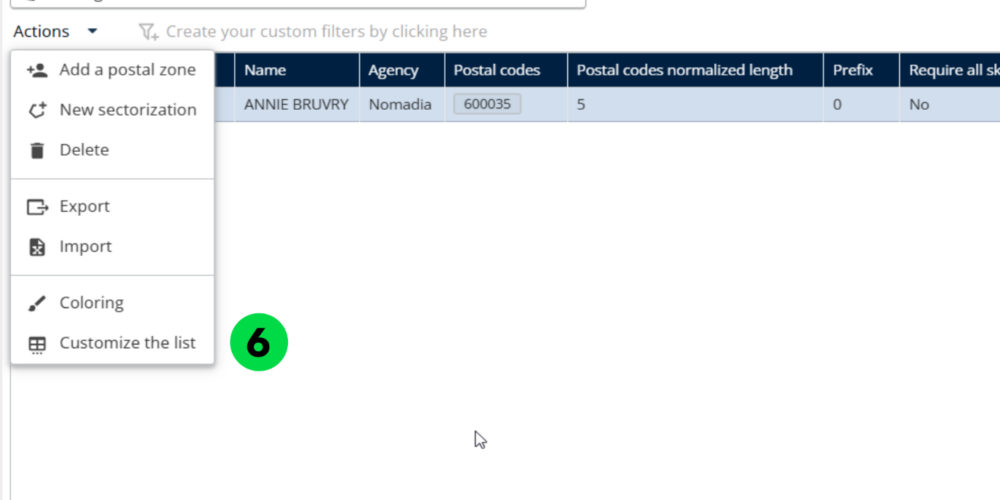

1. Choose which fields you want to display on the table\.

__      Note__: Avoid selecting too many fields at once, as it may become difficult to read or  

__      __navigate\.

1. Click on __Save__

1. The selected fields have been displayed on the table\. 

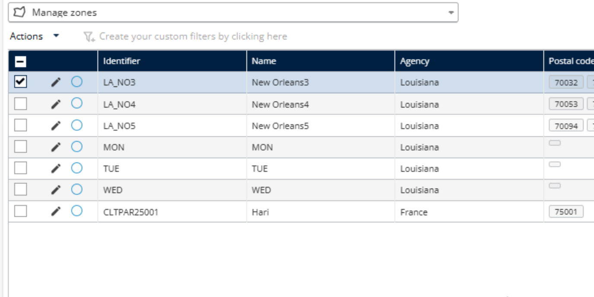

### 6\.3\.2\. Manage Vehicle Fleets

