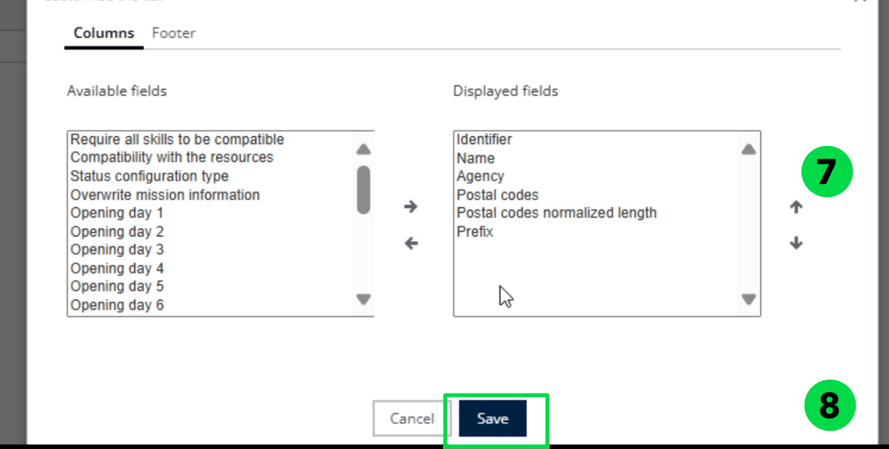

# 7.1. Manage Postal Zones

The Manage Postal Zones feature allows administrators and logistics managers to define and manage geographical delivery zones based on postal codes. These zones are

essential for organizing deliveries, assigning resources, and optimizing routes within specificareas

## 1. Import Postal Zones 

**Field name in import file**

**Field name in back-office table**

**Description**

Id

Code

Mandatory. It should be unique among the other Zone ids

Name

Name

Mandatory

Organization

Agency

Mandatory

Postal Codes

Postal Codes

Normalized Size

Postal Codes normalized length

Normalize With

Prefix

All Skills Required

Require all skills to be compatible

Skills

N/A

Status Customization Types

N/A

Wkt Geometry

N/A

Opening Days

Opening day x

Suffix x is equal from 1 to 10

Opening Hours

Opening Hours x

Suffix x is equal from 1 to 10

1. Click on **Configuration Tab**

!\[A screenshot of a computer

AI-generated content may be incorrect.]\(screenshots/postalzones/image\_1.png)

1. Click on \_\_Configuration \_\_Menu
2. Under **My data** section, click on Manage Zones

.png>)

1. Click the **Actions** dropdown menu.
2. Click on **Import**

!\[A screenshot of a computer

AI-generated content may be incorrect.]\(screenshots/postalzones/image\_3.png)

1. Click on **Browse File** to upload the file that contains the zone data.

!\[A screenshot of a computer

AI-generated content may be incorrect.]\(screenshots/postalzones/image\_4.png)

1. Select a valid **Zone file** from your local system.

.png>)

1. Postal Zones will be imported successfully.

.png>)

## 6.3.1.2. Add a Postal Zone 

1. Click on **Configuration Tab**
2. Click on **Configuration Menu**
3. Under My data section, click on **Manage Zones**
4. Click the **Actions** dropdown menu.
5. Click on **Add a Postal Zone.**

.png>)

1. Fill in the required fields: **Code**, **Name**, and **Prefix**.

**Note**: The Prefix is used to standardize postal codes to a fixed length of 6 digits. In regions where postal codes are shorter (e.g., 5 digits in some areas of France), the system automatically adds the defined prefix to reach the required length.

!\[A screenshot of a computer

AI-generated content may be incorrect.]\(screenshots/postalzones/image\_8.png)

1. Click on **Save**

!\[A white rectangular object with a black border

AI-generated content may be incorrect.]\(screenshots/postalzones/image\_9.png)

1. Postal Zones will be added successfully

.png>)

## 6.3.1.3. Create Postal Zones by Territory Management (Sectorization) 

1. Click on **Configuration Tab**
2. Click on **Configuration Menu**
3. Under My data section, click on **Manage Zones**
4. Select a **Mission**
5. Click the **Actions** dropdown menu.
6. Click on \_\_New Sectorization. \_\_

For detailed information, refer to the Territory Manager Manual available at the following link:

[https://mynomadia.com/doc/tm/docs/en/tm-book/\_districting.html](https://mynomadia.com/doc/tm/docs/en/tm-book/_districting.html)

.png>)

1. Select the appropriate **Indicators** and define the **Time Period**
2. Click on **Assign Territories**

.png>)

1. Click on **Automation**

.png>)

1.  In the **Balancing Points** section, click **Start** to prepare the system for

    automatic balancing.

.png>)

1. Click **“Let’s go!”** to launch the automated balancing of territories.

.png>)

1. Sectors are generated according to the balancing rules set by the user.
2. To ensure the sectorization respects postal code boundaries, click on **Administrative Borders** and select **Postal Code** from the dropdown menu.

.png>)

Sectors are aligned based on postal boundaries

**Disclaimer: Postal code boundary data is unavailable for certain countries.**

## 6.3.1.4. Delete a Postal Zone 

1. Click on **Configuration Tab**
2. Click on **Configuration Menu**
3. Under My data section, click on **Manage Zones**
4. Select a **Zone**

.png>)

1. Click the **Actions** dropdown menu.
2. Click on **Delete**

!\[A screenshot of a computer

AI-generated content may be incorrect.]\(screenshots/postalzones/image\_18.png)

1. You will see a confirmation pop-up message stating: "\_\_Are you sure you want to \_\_

\_\_ delete this zone?"\_\_

1. Click on **Yes**

!\[A screenshot of a computer

AI-generated content may be incorrect.]\(screenshots/postalzones/image\_19.png)

1. Postal Zone will be deleted successfully

.png>)

## 6.3.1.5. Export a Postal Zone 

1. Click on **Configuration Tab**
2. Click on **Configuration Menu**
3. Under My data section, click on **Manage Zones**
4. Select a **Zone**
5. Click the **Actions** dropdown menu.
6. Click on **Export**

.png>)

1. Postal Zone will be exported successfully

.png>)

## 6.3.1.6. Color a Postal Zone 

Apply conditions based on zone attributes such as type of mission (Delivery, Pickup), Zone priority, Assigned deliverer, Postal code prefix, etc.

1. Click on **Configuration Tab**
2. Click on **Configuration Menu**
3. Under My data section, click on **Manage Zones**
4. Select a **Zone**
5. Click the **Actions** dropdown menu.
6. Click on **Coloring**

!\[A screenshot of a computer

AI-generated content may be incorrect.]\(screenshots/postalzones/image\_23.png)

1. Choose a\_\_ Color\_\_
2. Click on **Save**

.png>)

1. The selected color has been applied successfully.

.png>)

## 6.3.1.7. Customize Zones Table 

Refer to [4.3.1.1. Import a Postal Zones](managepostalzones.md#_4.3.1.1._Import_a) to have the complete list of available fields.

1. Click on **Configuration Tab**
2. Click on **Configuration Menu**
3. Under My data section, click on **Manage Zones**
4. Select a **Zone**
5. Click the **Actions** dropdown menu.
6. Click on **Customize Limit**

.png>)

1. Choose which fields you want to display on the table.

\_\_ Note\_\_: Avoid selecting too many fields at once, as it may become difficult to read or

\_\_ \_\_navigate.

1. Click on **Save**

1. The selected fields have been displayed on the table.

.png>)

## 6.3.2. Manage Vehicle Fleets 
