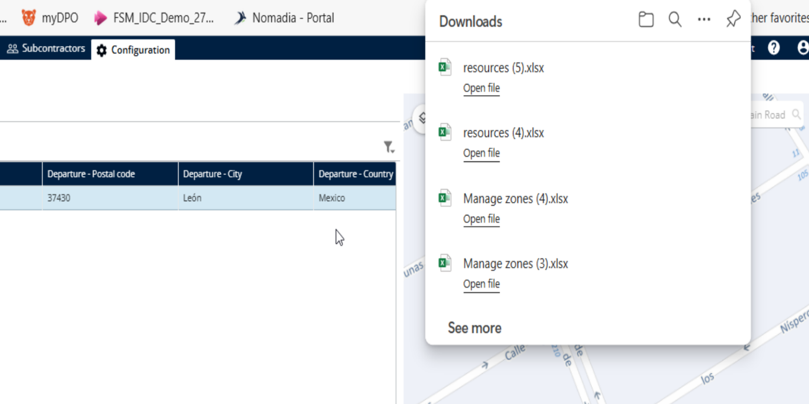
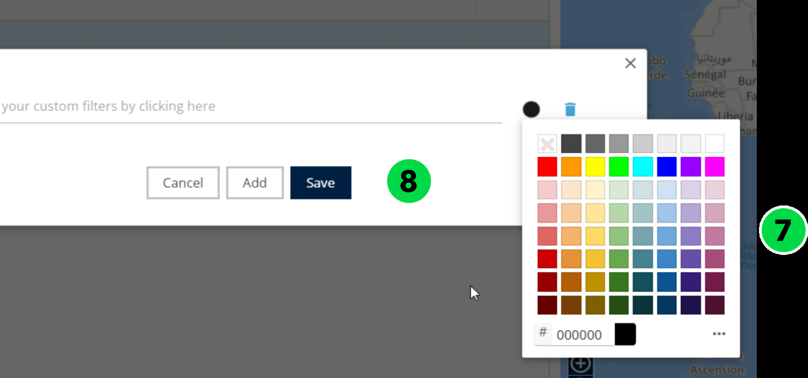
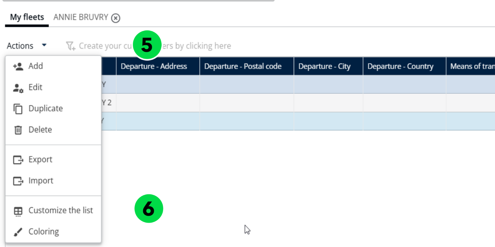
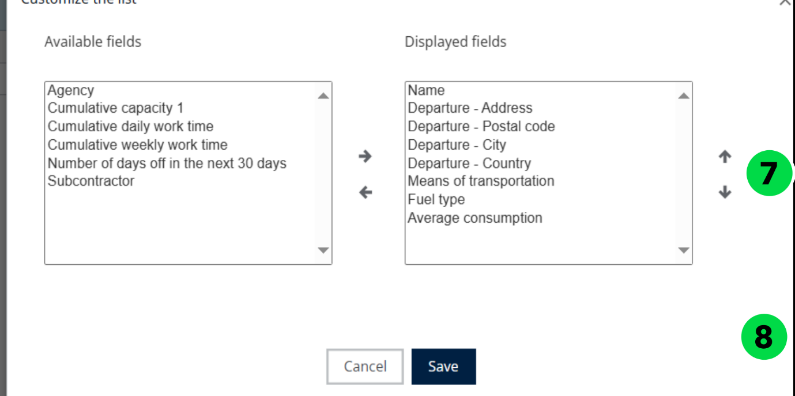
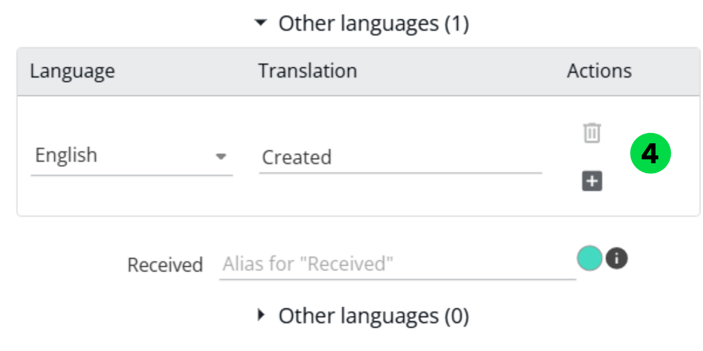

# Manage Vehicle Fleets

## 7.2. Manage Vehicle Fleets 

The Manage Vehicle Fleets in Nomadia Delivery allows administrators and planners to maintain an up-to-date registry of the vehicles used for delivery operations. This includes adding, editing, or deactivating vehicles, assigning specific characteristics, and ensuring that each vehicle is properly configured to meet logistical needs.

#### 1. Import Vehicles fleets 

1. Go to **Configuration**.

<figure><figcaption></figcaption></figure>

2. Click on **Configuration menu**
3. Under **My Data**, click on **Manage the Vehicles**.

.png>)

4. Under **My Fleets**, click the \_\_Actions \_\_dropdown menu.
5. Click on **Import**

.png>)

6. Click on **Browse File** to upload the file

<figure><figcaption></figcaption></figure>

7. Select a **Valid file** from your local system.

.png>)

8. The vehicle fleets have been imported successfully.

.png>)

### 2. Add a Vehicles fleets 

1. Go to **Configuration**.
2. Click on **Configuration Menu**
3. Under My Data, click on **Manage the Vehicles**.
4. Under **My Fleets**, click the **Actions** dropdown menu.
5. Click on **Add**

.png>)

6. Enter the Name and **Agency name**
7. Click on **Add**

.png>)

8. The vehicle fleets have been added successfully.

.png>)

#### 3. Delete a Vehicles fleets 

1. Go to **Configuration**.
2. Click on **Configuration Menu**
3. Under My Data, click on **Manage the Vehicles**.
4. Select a **Team**
5. Under My Fleets, click the Actions dropdown menu.
6. Click on **Delete**

.png>)

7. You will see a confirmation pop-up message stating: "**Do you want to delete the Vehicle?"**
8. Click on **Delete**

.png>)

9. The Vehicle fleets have been deleted successfully.

.png>)

#### 4. Manage Vehicles in a fleet 

#### 4.1. Add a Vehicle 

1. Go to **Configuration**.
2. Click on **Configuration Menu**
3. Under My Data, click on **Manage the Vehicles**.
4. Click the **Desired** **Name**
5. Click on **Actions**
6. Click on Add from the dropdown menu

.png>)

7. Enter the **Name**

<figure><figcaption></figcaption></figure>

8. Click on **Add**

.png>)

#### 4.2. Customize the constraints 

1. Go to **Configuration**.
2. Click on **Configuration Menu**
3. Under My Data, click on **Manage the Vehicles**.
4. Click on the **Desired name**
5. Click on Actions&#x20;
6. Click on Add&#x20;
7. Click on Constraints

<figure><figcaption></figcaption></figure>

8. Choose which fields you want to display on the table.

&#x20;Note: Avoid selecting too many fields at once, as it may become difficult to read or navigate.

9. Click on **Save**

<figure><figcaption></figcaption></figure>

10. The Fields have been displayed successfully.

<figure><figcaption></figcaption></figure>

#### 4.3. Delete a Vehicle 

1. Go to **Configuration**.
2. Click on **Configuration Menu**
3. Under My Data, click on **Manage the Vehicles**.
4. Click the **Desired** **Name**
5. Click on **Actions**
6. Click on Delete from the dropdown menu

.png>)

7. You will see a confirmation pop-up message stating: "**Do you want to delete the Vehicle?"**
8. Click on Delete.

.png>)

9. Vehicles have been deleted successfully

<figure><figcaption></figcaption></figure>

#### 4.4. Export a Vehicle 

1. Go to **Configuration**.
2. Click on **Configuration Menu**
3. Under My Data, click on **Manage the Vehicles**.
4. Click the **Desired** **Name**
5. Click on **Actions**
6. Click on Export from the dropdown menu

.png>)

7. The vehicles have been exported successfully.

.png>)

#### 4.5. Color a Vehicle 

1. Go to **Configuration**.
2. Click on **Configuration Menu**
3. Under My Data, click on **Manage the Vehicles**.
4. Click the **Desired** **Name**
5. Click on **Actions**
6. Click on Coloring from the dropdown menu

<figure><figcaption></figcaption></figure>

7. Choose a **Color**
8. Click on **Save**

.png>)

9. The color has been applied successfully.

<figure><figcaption></figcaption></figure>

#### 4.6. Customize Vehicles table 

1. Go to **Configuration**.
2. Click on **Configuration Menu**
3. Under My Data, click on **Manage the Vehicles**.
4. Click the **Desired** **Name**
5. Click on **Actions**
6. Click on Customize the list from the dropdown menu

<figure><figcaption></figcaption></figure>

7. Choose which fields you want to display on the table.

&#x20; Note: Avoid selecting too many fields at once, as it may become difficult to read or navigate.

8. Click on **Save**

9. The selected fields will be displayed on the table successfully

<figure><figcaption></figcaption></figure>

#### 4.7. Export a Vehicles fleets 

1. Go to **Configuration**.
2. Click on **Configuration Menu**
3. Under My Data, click on **Manage the Vehicles**.
4. Select a **Team**
5. Under **My Fleets**, click the **Actions** dropdown menu.
6. Click on **Export**

7\. The vehicles fleets will be exported successfully.

#### 4.8. Color a Vehicles fleets 

Apply conditions based on zone attributes such as type of mission (Delivery, Pickup),

Zone priority, Assigned deliverer, Postal code prefix, etc.

1. Go to **Configuration**.
2. Click on **Configuration Menu**
3. Under **My Data**, click on **Manage the Vehicles**.
4. Select a **Team**
5. Under My Fleets, click the Actions dropdown menu.
6. Click on **Coloring**

7. Choose a **Color**
8. Click on Save

9. The selected color has been applied successfully

<figure><figcaption></figcaption></figure>

#### 4.9. Customize Vehicles fleets table 

1. Go to **Configuration**.
2. Click on **Configuration Menu**
3. Under **My Data**, click on **Manage the Vehicles**.
4. Select a **Team**
5. Under My Fleets, click the Actions dropdown menu.
6. Click on **Customize the list**

7. Choose which fields you want to display on the table.

&#x20; Note: Avoid selecting too many fields at once, as it may become difficult to read or navigate.

8. Click on **Save**

9. The selected fields have been displayed on the table successfully

<figure><figcaption></figcaption></figure>

#### 4.10. Customizing Status Labels. 

Previously, statuses in Nomadia Delivery were static and could not be customized to adapt to customer workflows. Customizable status labels now enhance mission tracking by giving users full control to configure status labels and colors to align with their business workflows.

**Status Labels – Description**

* **Waiting** - Initial status. The Parcel is expected to arrive at the agency.
* **Received** - Optional Status: Indicates the parcel has been received by the deliverer. The exact location depends on context.
* **Not received** - Optional Status: Indicates the parcel was expected but not received by the deliverer. Location is dependent on context.
* **To be delivered** - Parcel is scheduled for delivery by the transporter or subcontractor.
* **To be loaded** - Optional Status: Parcel is ready at the docking area, awaiting loading onto the vehicle.
* **Loaded** - Optional Status: Parcel has been successfully loaded onto the truck by the deliverer.
* **Not loaded** - Optional Status: Parcel was expected but not loaded onto the truck
* **Not delivered** - Delivery attempt failed; parcel was not handed over to the customer.
* **Delivered** - Parcel has been delivered to the final recipient.
* **To be picked up** - Parcel is scheduled for pickup by the transporter or subcontractor.
* **Picked up** - Parcel has been collected from the contractor or end-customer.
* **Not Picked up** - Pickup attempt failed; parcel was not collected.
* **To be Visited** - Visit is scheduled by the transporter or subcontractor.
* **Visited** - Visit was completed by the deliverer.
* **Not Visited** - Visit was scheduled but not completed.

To customize status labels in Nomadia Delivery, follow the steps below.

1. Open the Nomadia Delivery application and navigate to the Configuration tab.

2. Select Customize Status Labels from the list.

This page displays all statuses in Nomadia Delivery.

3. Click the text box next to the status and update the label to match your business workflow.

4. Click the Other Languages accordion to update labels for users in different languages or countries.

5. Click the Color Picker to change the background color of a status label. Ensure you choose a contrasting color that maintains text readability in the UI.

6. After making the changes, click Save to apply the label and color updates across both the web and mobile applications.

7. After saving the changes, return to the mission page to view the updated labels and colors in the pre-filter area

This provides a smooth, business-aligned experience for both planners and deliverers.
