### 6\.3\.2\. Manage Vehicle Fleets

The Manage Vehicle Fleets in Nomadia Delivery allows administrators and planners to maintain an up\-to\-date registry of the vehicles used for delivery operations\. This includes adding, editing, or deactivating vehicles, assigning specific characteristics, and ensuring that each vehicle is properly configured to meet logistical needs\.

### 6\.3\.2\.1\. Import Vehicles fleets

1. Go to __Configuration__\.

1. Click on __Configuration menu__
2. Under __My Data__, click on __Manage the Vehicles__\.

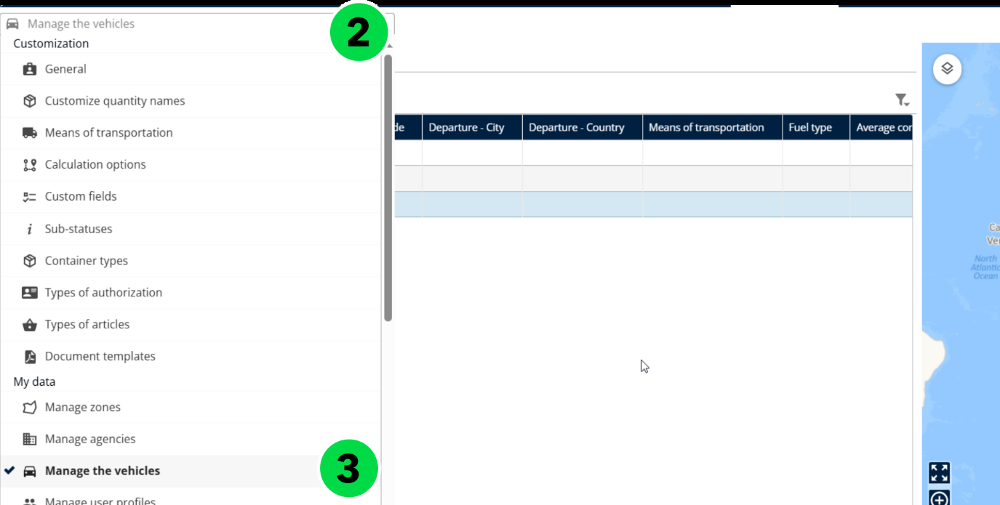

1. Under __My Fleets__, click the __Actions __dropdown menu\.
2. Click on __Import__

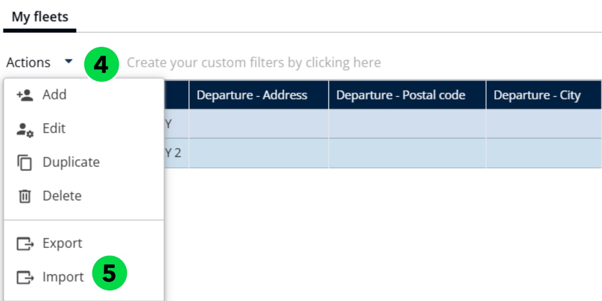

1. Click on __Browse File__ to upload the file

1. Select a __Valid file__ from your local system\.

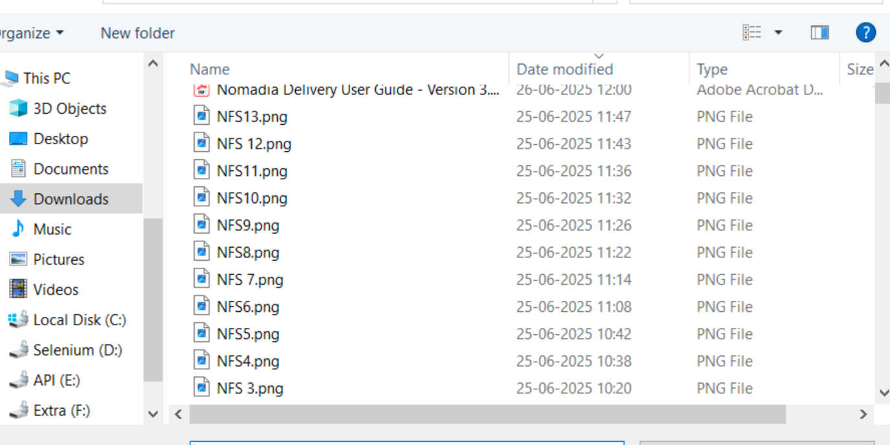

1. The vehicle fleets have been imported successfully\. 

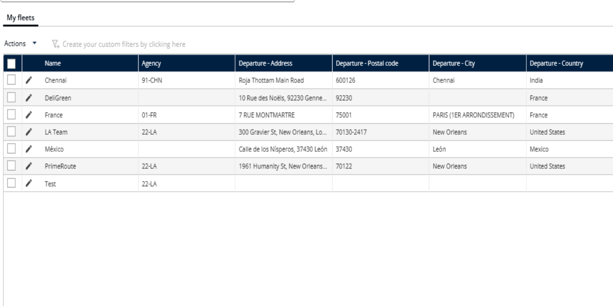

### 6\.3\.2\.2\. Add a Vehicles fleets

1. Go to __Configuration__\.
2. Click on __Configuration Menu__
3. Under My Data, click on __Manage the Vehicles__\.
4. Under __My Fleets__, click the __Actions__ dropdown menu\.
5. Click on __Add__

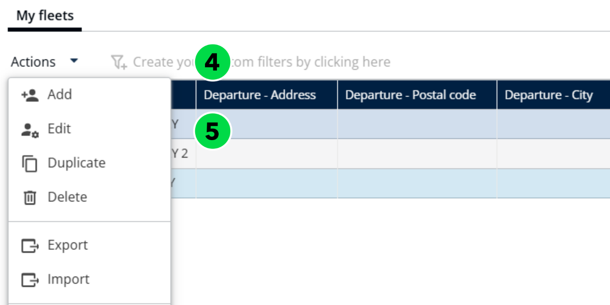

1. Enter the __Name __and __Agency name__
2. Click on __Add__

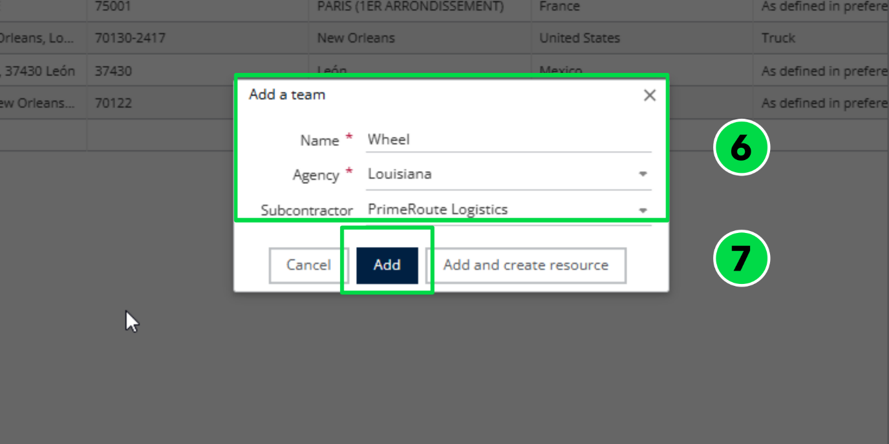

1. The vehicle fleets have been added successfully\.

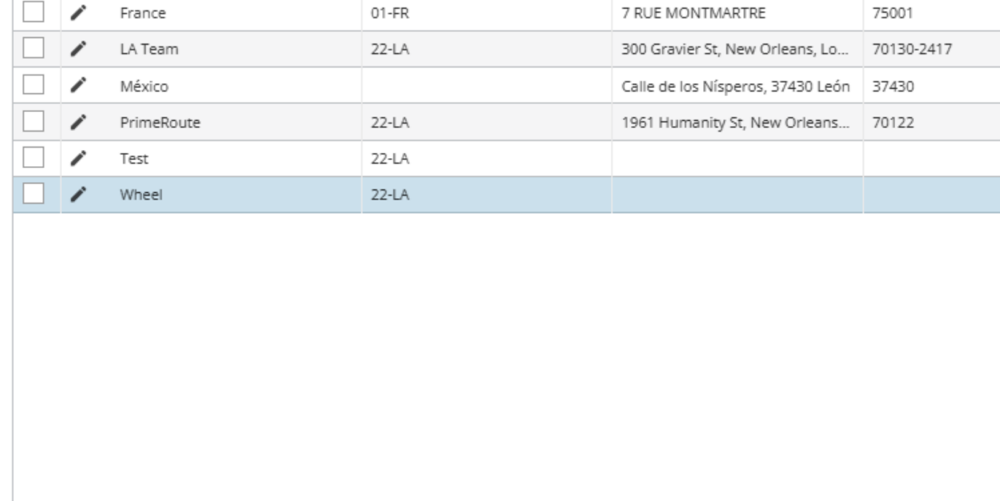

### 6\.3\.2\.3\. Delete a Vehicles fleets

1. Go to __Configuration__\.
2. Click on __Configuration Menu__
3. Under My Data, click on __Manage the Vehicles__\.
4. Select a __Team__
5. Under My Fleets, click the Actions dropdown menu\.
6. Click on __Delete__

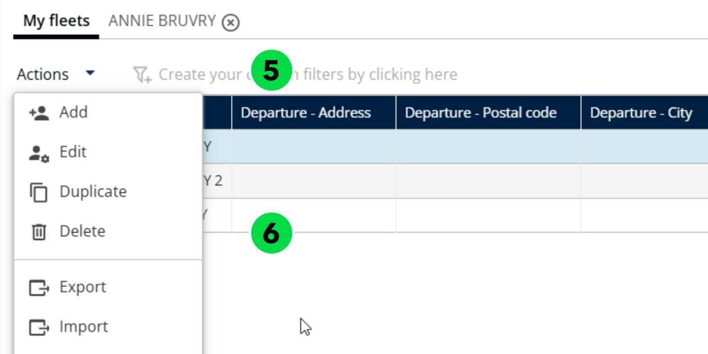

1. You will see a confirmation pop\-up message stating: "__Do you want to delete the Vehicle?"__
2. Click on __Delete__

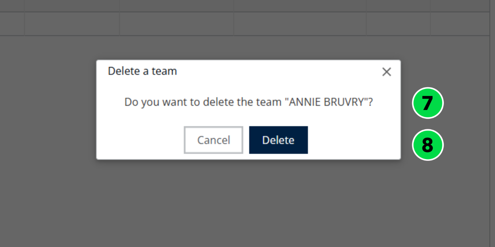

1. The Vehicle fleets have been deleted successfully\. 

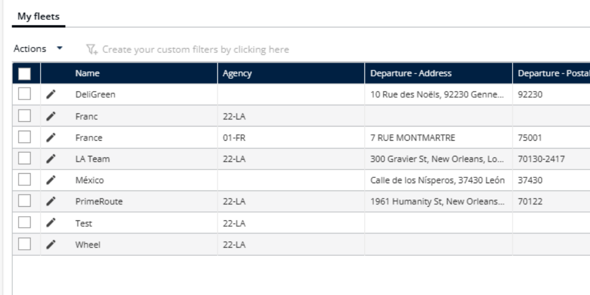

### 6\.3\.2\.4\. Manage Vehicles in a fleet

### 6\.3\.2\.4\.1\. Add a Vehicle

1. Go to __Configuration__\.
2. Click on __Configuration Menu__
3. Under My Data, click on __Manage the Vehicles__\.
4. Click the __Desired__ __Name__
5. Click on __Actions__
6. Click on__ Add __from the dropdown menu

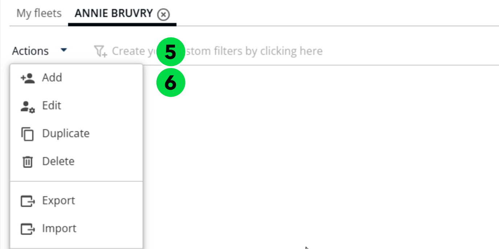

1. Enter the __Name__

1. Click on __Add__

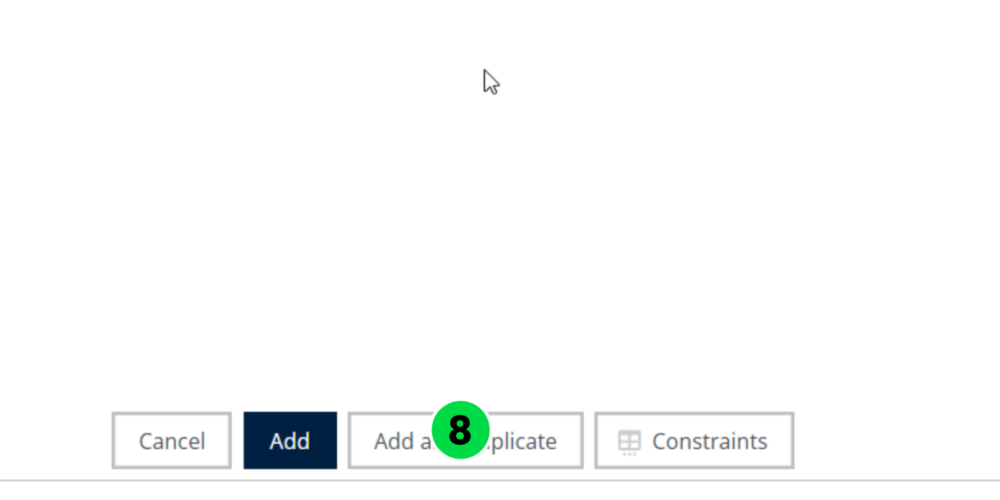

### 6\.3\.2\.5\. Customize the constraints

1. Go to __Configuration__\.
2. Click on __Configuration Menu__
3. Under My Data, click on __Manage the Vehicles__\.
4. Click on the __Desired name__
5. Click on__ Actions__
6. Click on__ Add__
7. Click on__ Constraints__

1. Choose which fields you want to display on the table\.

__      Note__: Avoid selecting too many fields at once, as it may become difficult to read or navigate\.

1. Click on __Save__

1. The Fields have been displayed successfully\. 

### 6\.3\.2\.5\.1\. Delete a Vehicle

1. Go to __Configuration__\.
2. Click on __Configuration Menu__
3. Under My Data, click on __Manage the Vehicles__\.
4. Click the __Desired__ __Name__
5. Click on __Actions__
6. Click on__ Delete __from the dropdown menu

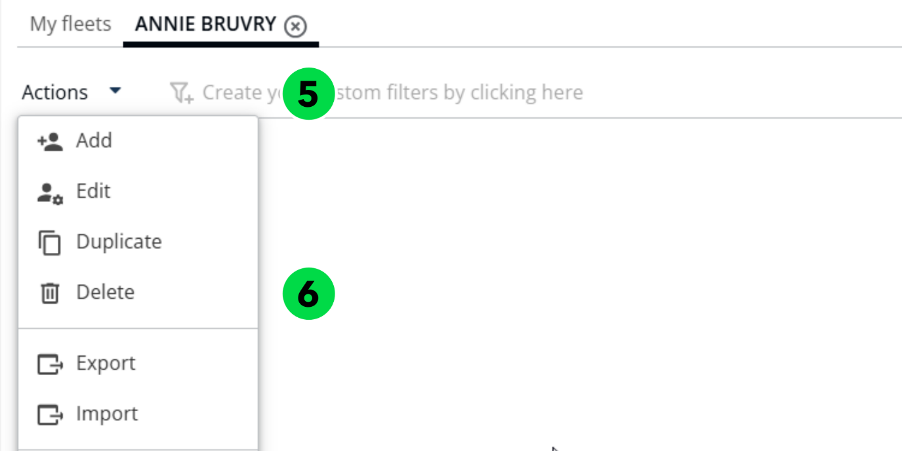

1. You will see a confirmation pop\-up message stating: "__Do you want to delete the Vehicle?"__
2. Click on __Delete\. __

1. Vehicles have been deleted successfully

### 6\.3\.2\.5\.2\. Export a Vehicle

1. Go to __Configuration__\.
2. Click on __Configuration Menu__
3. Under My Data, click on __Manage the Vehicles__\.
4. Click the __Desired__ __Name__
5. Click on __Actions__
6. Click on__ Export __from the dropdown menu

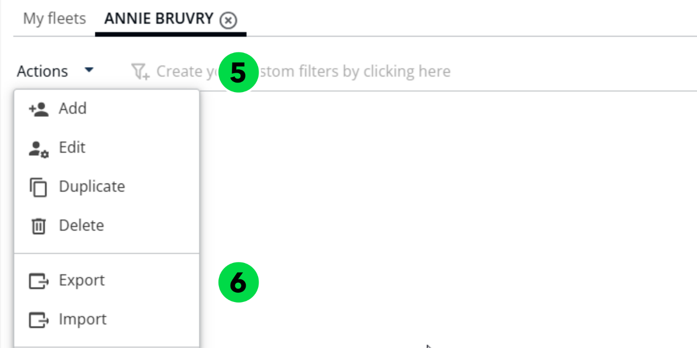

1. The vehicles have been exported successfully\. 

### 6\.3\.2\.5\.3\. Color a Vehicle

1. Go to __Configuration__\.
2. Click on __Configuration Menu__
3. Under My Data, click on __Manage the Vehicles__\.
4. Click the __Desired__ __Name__
5. Click on __Actions__
6. Click on__ Coloring __from the dropdown menu

1. Choose a __Color__
2. Click on __Save__

1. The color has been applied successfully\. 

### 6\.3\.2\.5\.4\. Customize Vehicles table

1. Go to __Configuration__\.
2. Click on __Configuration Menu__
3. Under My Data, click on __Manage the Vehicles__\.
4. Click the __Desired__ __Name__
5. Click on __Actions__
6. Click on__ Customize the list __from the dropdown menu

1. Choose which fields you want to display on the table\.

__        Note__: Avoid selecting too many fields at once, as it may become difficult to read or   

__        __navigate\.

1. Click on __Save__

19\. The selected fields will be displayed on the table successfully

### 

### 6\.3\.2\.6\. Export a Vehicles fleets

1. Go to __Configuration__\.
2. Click on __Configuration Menu__
3. Under My Data, click on __Manage the Vehicles__\.
4. Select a __Team__
5. Under __My Fleets__, click the __Actions__ dropdown menu\.
6. Click on __Export__

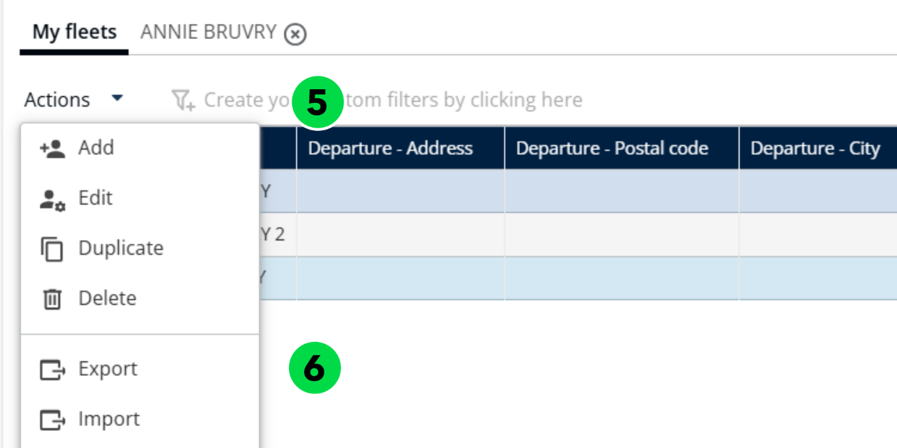

7\. The vehicles fleets will be exported successfully\. 

### 6\.3\.2\.7\. Color a Vehicles fleets

Apply conditions based on zone attributes such as type of mission \(Delivery, Pickup\), 

Zone priority, Assigned deliverer, Postal code prefix, etc\.

1. Go to __Configuration__\.
2. Click on __Configuration Menu__
3. Under __My Data__, click on __Manage the Vehicles__\.
4. Select a __Team__
5. Under My Fleets, click the Actions dropdown menu\.
6. Click on __Coloring__

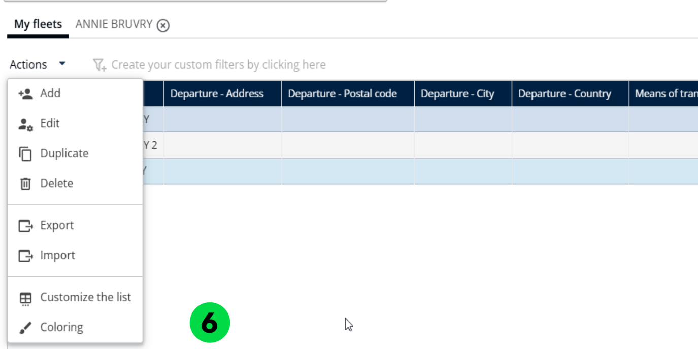

1. Choose a __Color__
2. Click on__ Save__

1. The selected color has been applied successfully

### 6\.3\.2\.8\. Customize Vehicles fleets table

1. Go to __Configuration__\.
2. Click on __Configuration Menu__
3. Under __My Data__, click on __Manage the Vehicles__\.
4. Select a __Team__
5. Under My Fleets, click the Actions dropdown menu\.
6. Click on __Customize the list__

1. Choose which fields you want to display on the table\.

__     Note__: Avoid selecting too many fields at once, as it may become difficult to read or navigate\.

1. Click on __Save__

1. The selected fields have been displayed on the table successfully

### 6\.3\.2\.9\. Customizing Status Labels\. 

Previously, statuses in Nomadia Delivery were static and could not be customized to adapt to customer workflows\. Customizable status labels now enhance mission tracking by giving users full control to configure status labels and colors to align with their business workflows\.

__Status Labels – Description__

- __Waiting__ \- Initial status\. The Parcel is expected to arrive at the agency\. 
- __Received__ \- Optional Status: Indicates the parcel has been received by the deliverer\. The exact location depends on context\.
- __Not received__ \- Optional Status: Indicates the parcel was expected but not received by the deliverer\. Location is dependent on context\.
- __To be delivered__ \- Parcel is scheduled for delivery by the transporter or subcontractor\.
- __To be loaded__ \- Optional Status: Parcel is ready at the docking area, awaiting loading onto the vehicle\.
- __Loaded__ \- Optional Status: Parcel has been successfully loaded onto the truck by the deliverer\.
- __Not loaded__ \- Optional Status: Parcel was expected but not loaded onto the truck
- __Not delivered__ \- Delivery attempt failed; parcel was not handed over to the customer\.
- __Delivered__ \- Parcel has been delivered to the final recipient\.
- __To be picked up__ \- Parcel is scheduled for pickup by the transporter or subcontractor\.
- __Picked up__ \- Parcel has been collected from the contractor or end\-customer\.
- __Not Picked up__ \- Pickup attempt failed; parcel was not collected\.
- __To be Visited__ \- Visit is scheduled by the transporter or subcontractor\. 
- __Visited__ \- Visit was completed by the deliverer\.
- __Not Visited__ \- Visit was scheduled but not completed\.

To customize status labels in Nomadia Delivery, follow the steps below\.

1. Open the Nomadia Delivery application and navigate to the Configuration tab\.

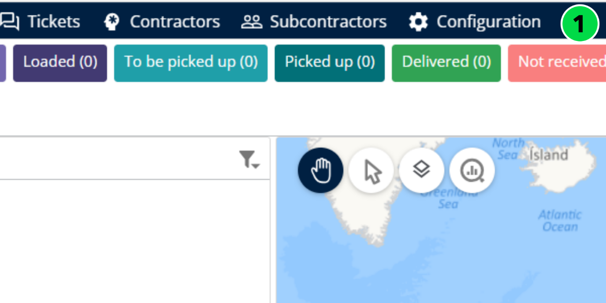

1. Select Customize Status Labels from the list\.

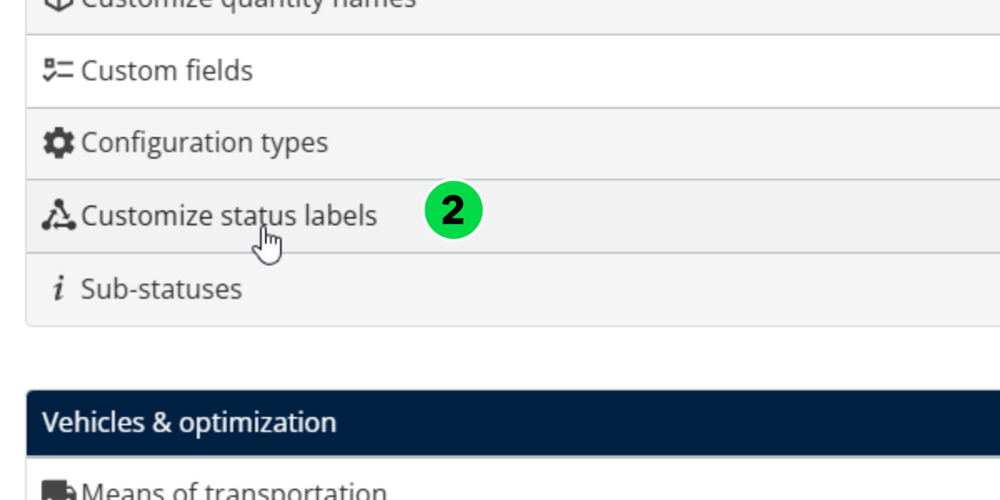

This page displays all statuses in Nomadia Delivery\.

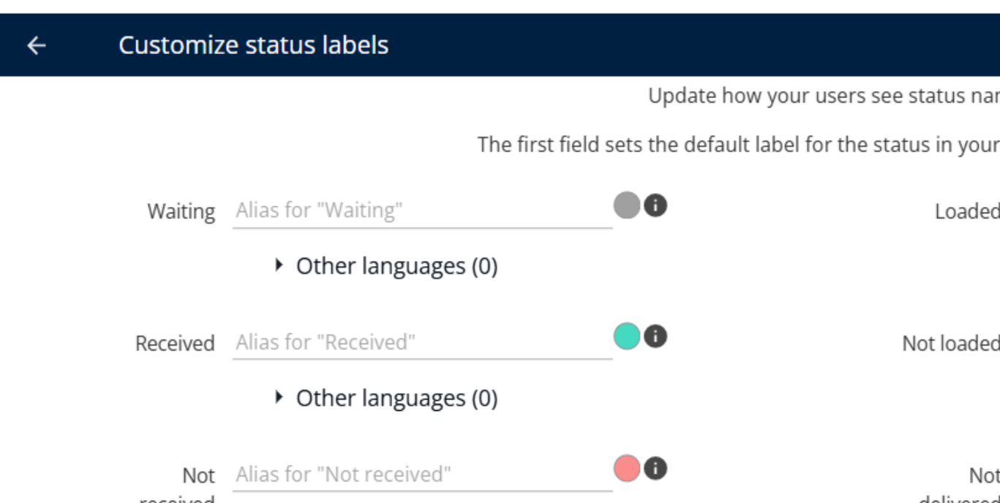

1. Click the text box next to the status and update the label to match your business workflow\.

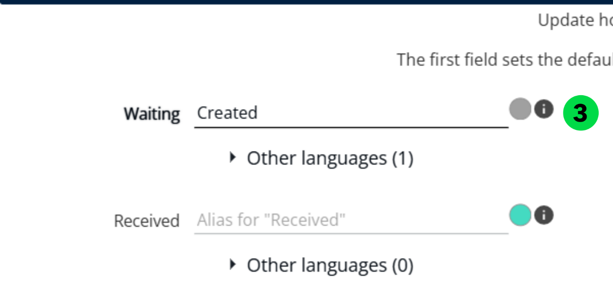

1. Click the Other Languages accordion to update labels for users in different languages or countries\.

1. Click the Color Picker to change the background color of a status label\. Ensure you choose a contrasting color that maintains text readability in the UI\.

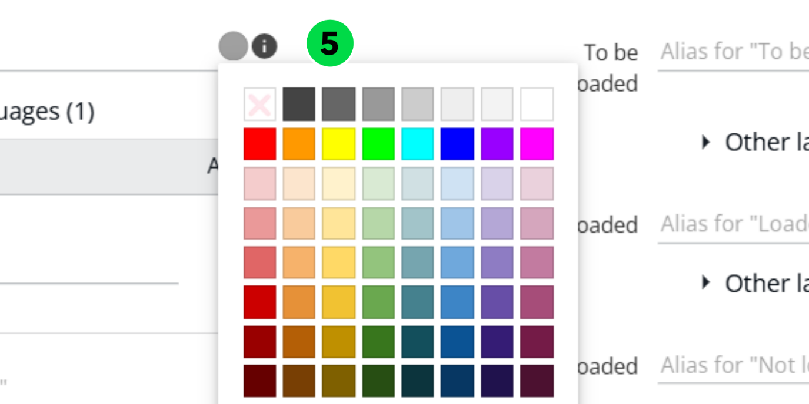

1. After making the changes, click Save to apply the label and color updates across both the web and mobile applications\.

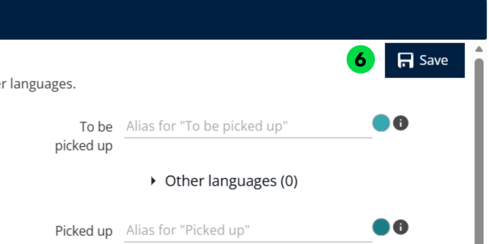

1. After saving the changes, return to the mission page to view the updated labels and colors in the pre\-filter area

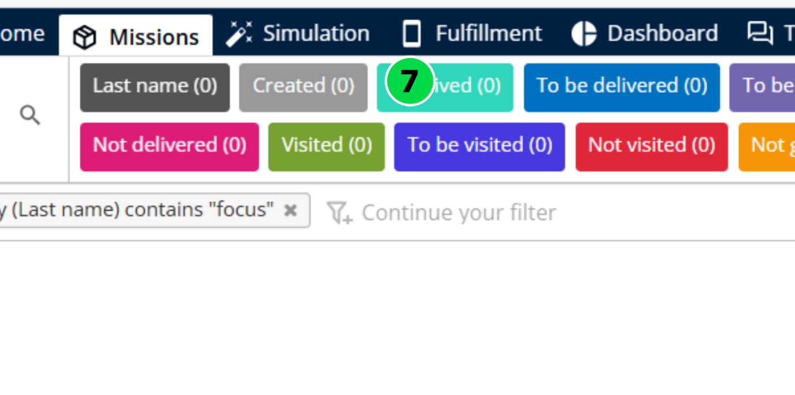

This provides a smooth, business\-aligned experience for both planners and deliverers\.

