### 6\.3\.3\. Manage Sub Statuses

The Manage Sub Statuses feature allows administrators to create, edit, and assign detailed status labels that reflect the real\-time progress or condition of a delivery task\. These sub statuses provide a more granular tracking mechanism within the broader status categories such as "Pickup", "Waiting", or "Delivered"

### 6\.3\.3\.1\. Create a Sub status

1. Go to __Configuration__\.
2. Click on __Configuration Menu__
3. Under __My Data__, click on __Sub statuses__\. 	

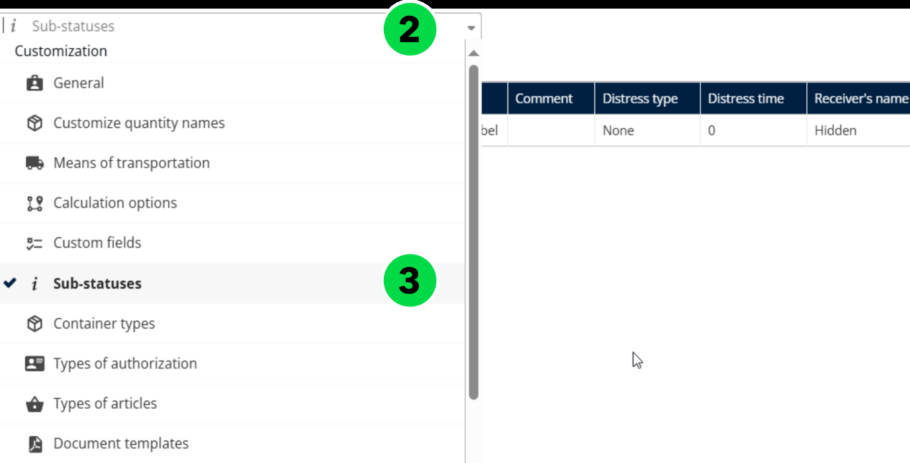

1. Click the __Actions__ dropdown menu
2. Click on __Add__

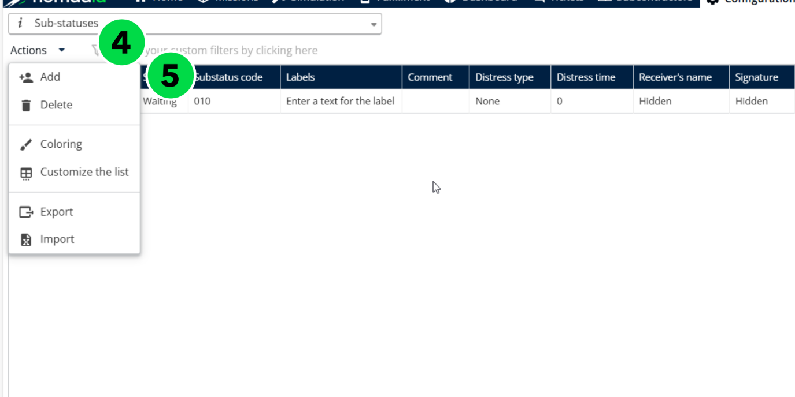

1. Enter the__ Sub status code__
2. Select the__ Status configuration type__

 

1. Click on__ Save__

1. Sub status has been created successfully

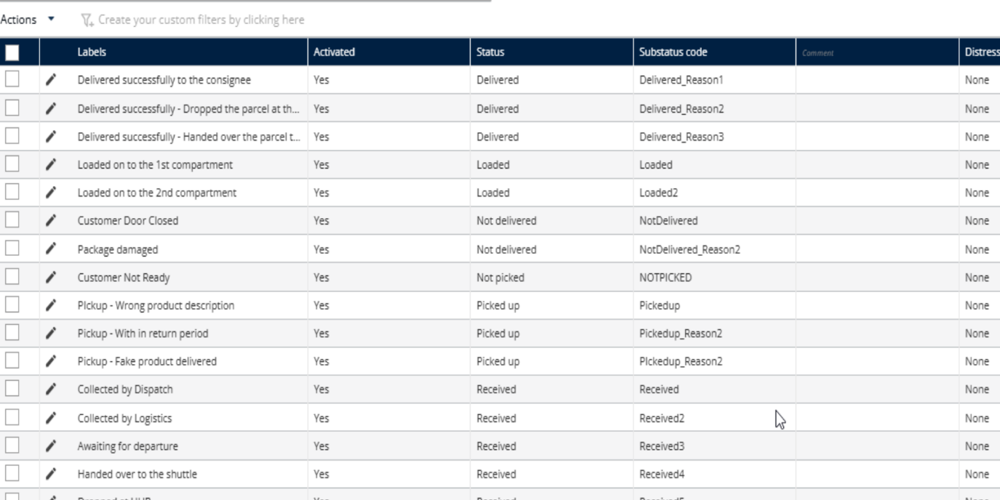

### 6\.3\.3\.2\. Delete a Sub status

1. Go to __Configuration__\.
2. Click on __Configuration Menu__
3. Under My Data, click on __Sub statuses__\.
4. Select a __Sub statuses__
5. Click the __Actions__ dropdown menu
6. Click on __Delete__

You will see a confirmation pop\-up message stating: "__Do you want to delete the sub\-status?"__

1. Click on__ Yes__

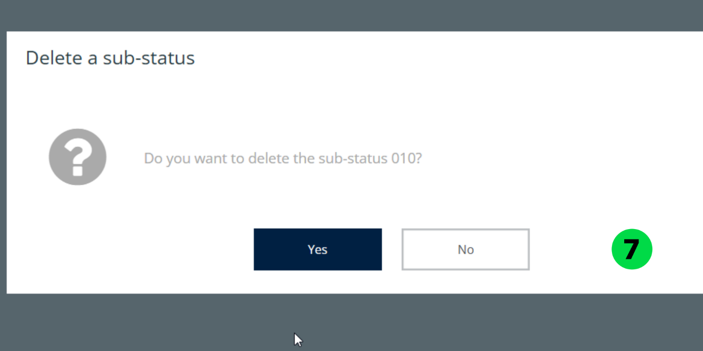

1. Sub status has been deleted successfully

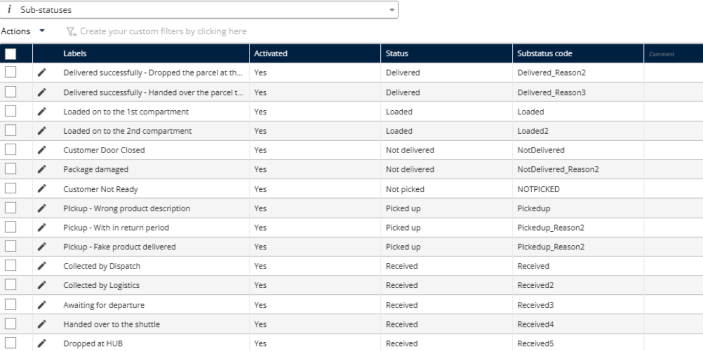

### 

### 6\.3\.3\.3\. Coloring a Sub status

Apply conditions based on zone attributes such as type of mission \(Delivery, Pickup\), Zone priority, Assigned deliverer, Postal code prefix, etc\.

1. Go to __Configuration__\.
2. Click on __Configuration Menu__
3. Under __My Data__, click on __Sub statuses__\.
4. Select a __Sub statuses__
5. Click the __Actions__ dropdown menu
6. Click on __Coloring__

1. Choose a__ Color__
2. Click on__ Save__

1. The selected color has been applied successfully\. 

### 

### 6\.3\.3\.4\. Customize Sub statuses table

1. Go to __Configuration__\.
2. Click on __Configuration Menu__
3. Under __My Data__, click on __Sub statuses__\.
4. Select a __Sub statuses__
5. Click the __Actions__ dropdown menu
6. Click on __Customize the Limit__

1. Choose which fields you want to display on the table\.

__     Note__: Avoid selecting too many fields at once, as it may become difficult to read or navigate\.

1. Click on __Save__

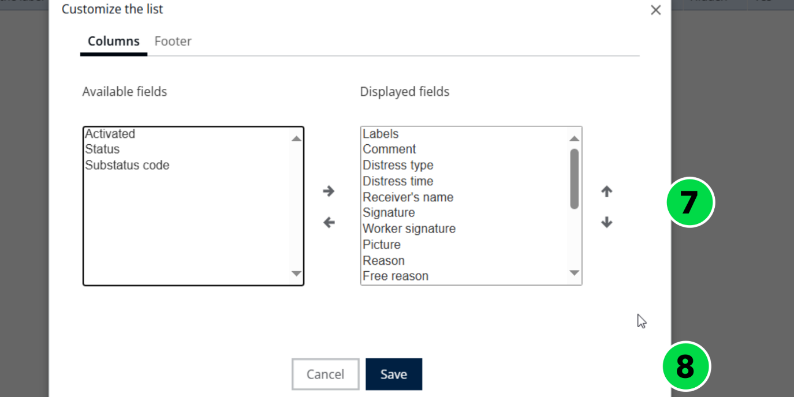

1. The selected fields have been displayed on the table successfully

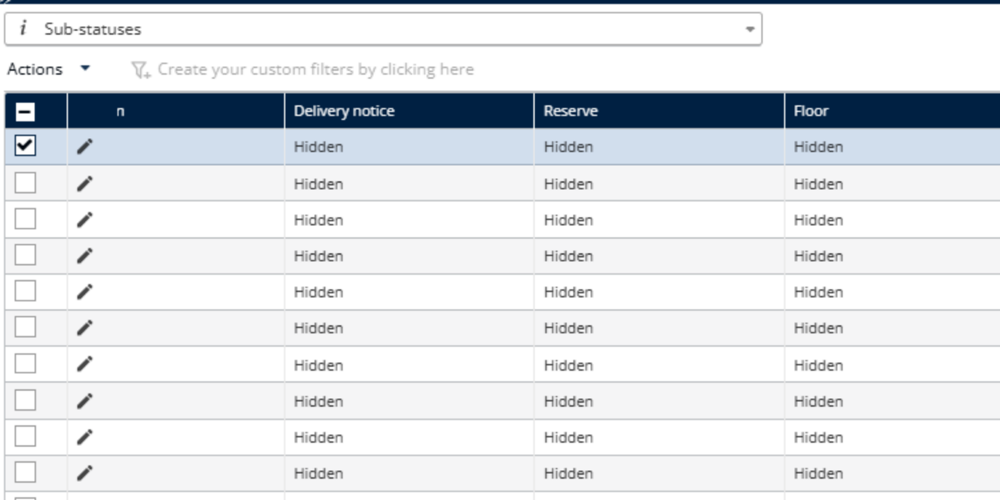

### 6\.3\.3\.5\. MANAGING SUB\-STATUS CONFIGURATION TYPES

Nomadia Delivery provides three types of sub\-status templates that enable users to personalize the delivery workflow according to the customer type or category\. These templates are Basic, Intermediate, and Advanced\.

- __Basic Configuration types__: Designed for customers who require only a single verification step,  

__     __such as capturing a photo or collecting a signature\. It simplifies the delivery process by including  

     only the essential checks\.

- __Intermediate Configuration types__: Suitable for customers who need multiple verification steps but do not require the full range of options available on the advanced template\.
- __Advanced Configuration types__: Intended for customers who demand comprehensive verification, such as taking photos at every stage of the delivery\. It provides maximum flexibility to configure detailed workflows\.

__Note__: The Configuration types options are provided solely to help differentiate delivery workflows based on customer categories\. However, the complexity of the workflow is entirely at the user’s discretion\. For example, a Basic template can still be configured to support a complex delivery process if needed\.

To configure and manage sub\-status configuration types in Nomadia Delivery, follow these steps:

1. Open the Nomadia Delivery application and go to the __Configuration module__\.

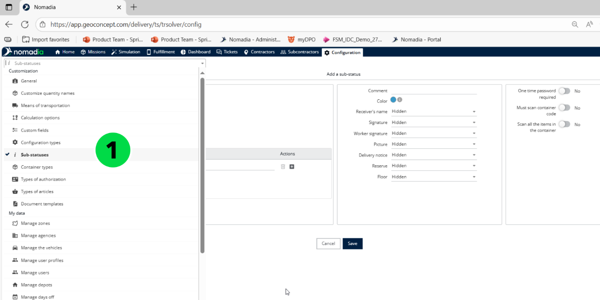

1. Click on the __Actions__ button, then choose __Add__ to create a new sub\-status\.

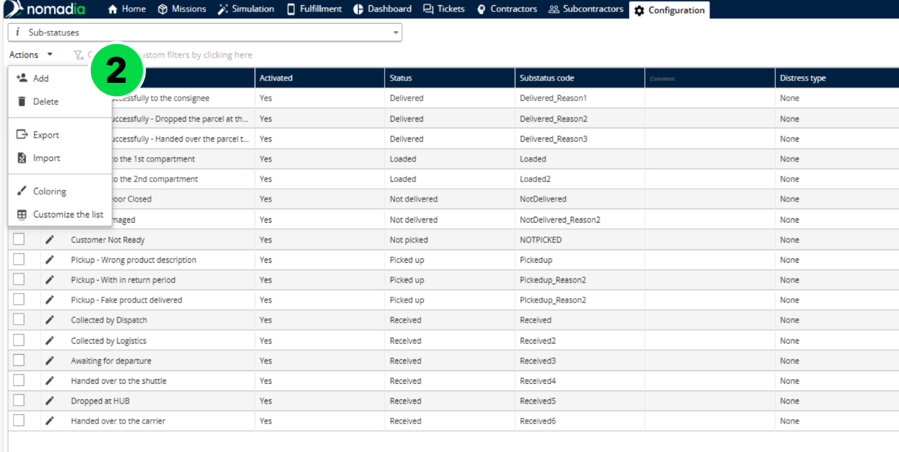

1. Assign the created sub\-status to one or more templates\.

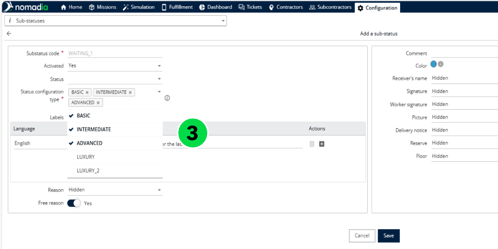

1. Define the required actions for each sub\-status, such as making signature mandatory, requiring a    

     photo, etc\.

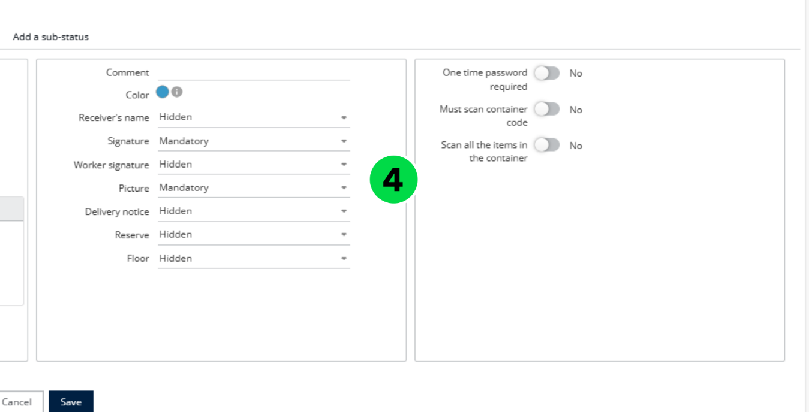

1. Repeat the process to create additional sub\-statuses and link them to the desired templates\.

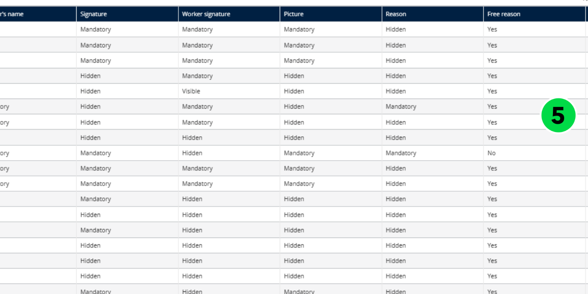

1. Once all templates are configured, navigate to the __Missions__ tab\.
2. Click on the __Mission Editor__ button to attach a sub\-status template to a mission\.

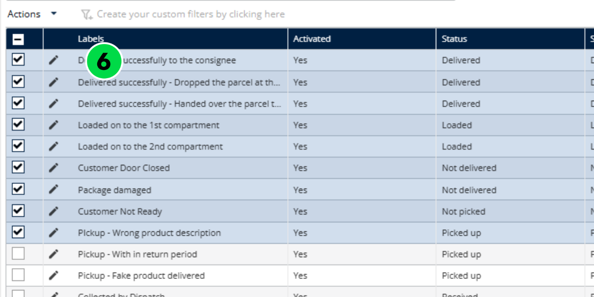

1. Select the appropriate sub\-status configuration template for the chosen mission

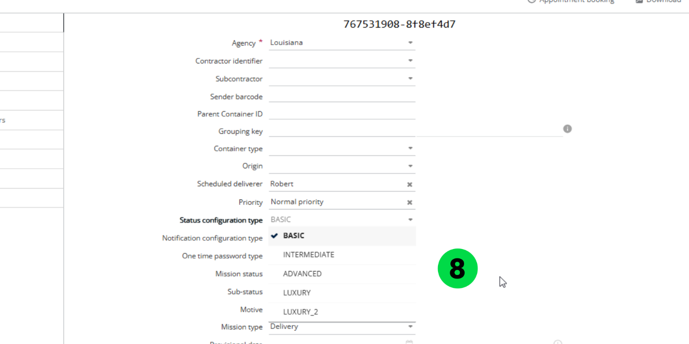

1. Alternatively, configure templates in bulk during mission import by mapping the Excel field to the  

     Status configuration type with values like __BASIC__, __INTERMEDIATE__, or __ADVANCED__\.

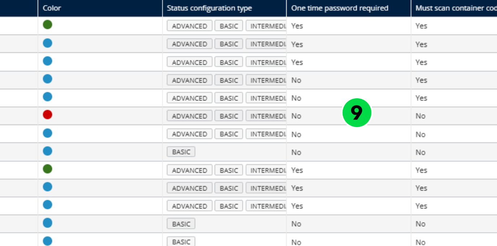

### 6\.3\.3\.6\. Trigger Notifications for Sub Status Changes

The Trigger Notifications for Sub\-Status Changes feature enables accurate, real\-time communication with all stakeholders involved in parcel movement\. It improves transparency, coordination, and overall service quality across first\-mile, mid\-mile, and last\-mile operations\.

To configure notifications for sub\-status changes, follow the steps below:

1. Open the Nomadia Delivery application and go to the Configuration tab\.

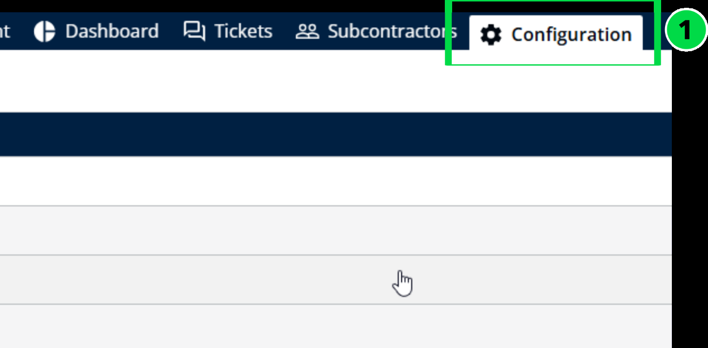

1. Select Sub\-statuses from the list\.

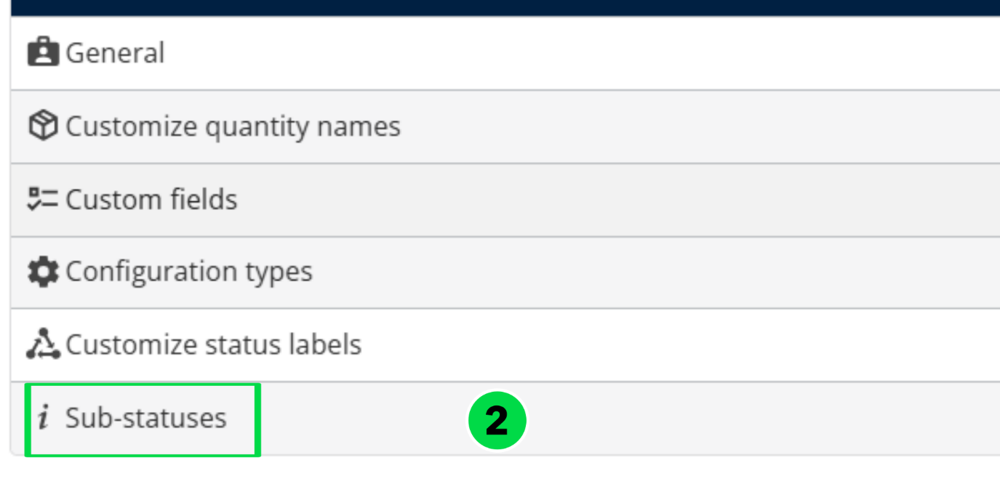

1. Click the Pencil icon next to the existing sub\-status to edit it\.

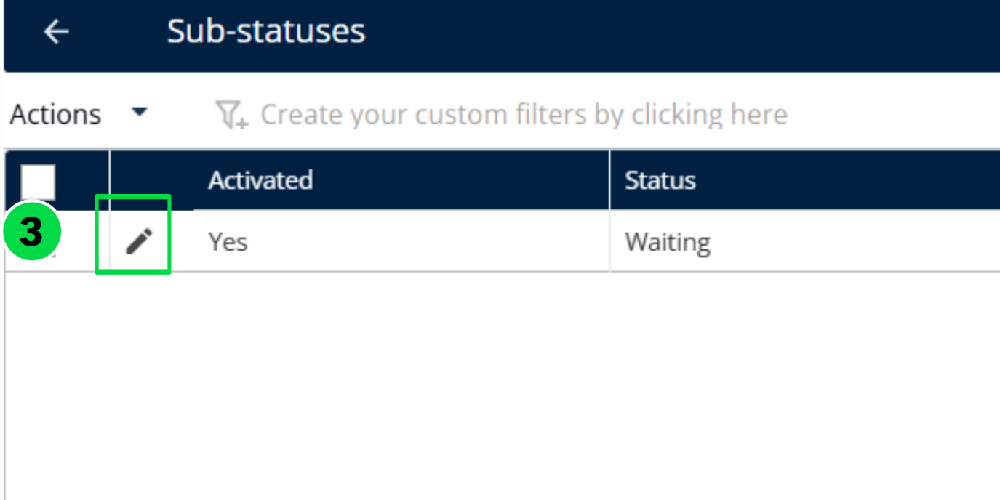

1. The Custom Messages Configuration section is displayed at the bottom of the page\.

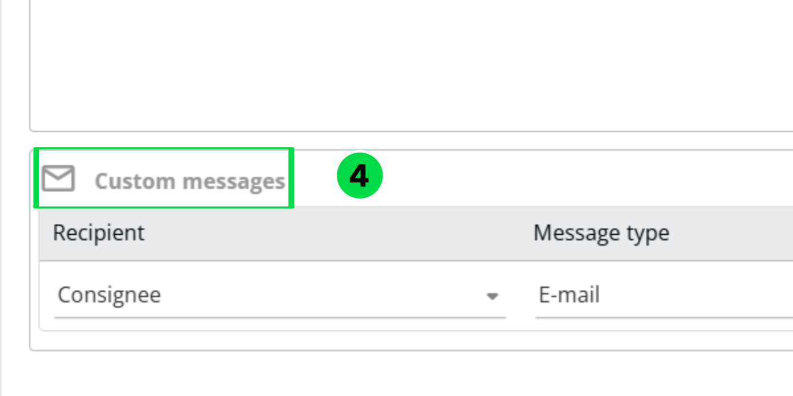

1. Click the \+ button to add the notification configuration to the sub status\. 

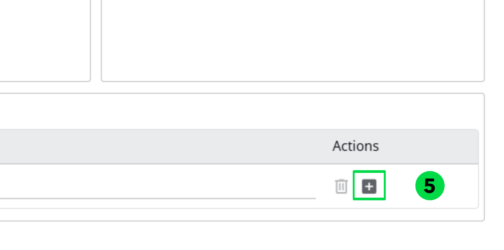

1. Notifications can be made for the following recipients:

- __Sender__ – The original sender of the mission\. Notifications are sent to the contractor’s email address or mobile number stored in the mission details\.
- __Consignee__ – The original recipient of the mission \(customer\)\. Notifications are sent to the delivery email address or mobile number stored in the mission details\.
- __Other Recipients__ – Any internal stakeholders who need to be informed about the mission’s transit, such as the dispatch or logistics teams\. This field accepts multiple email addresses or phone numbers, separated by commas\.

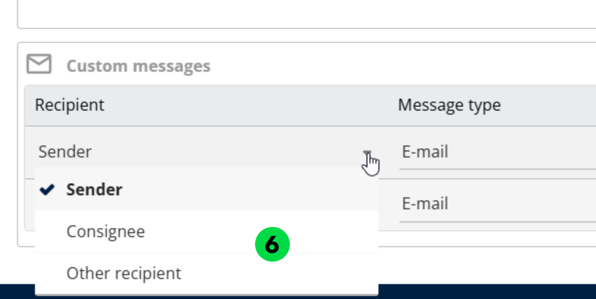

1. Notifications can be sent via Email or SMS\.

- To create a notification configuration, select a recipient, message type, and message template\. Please note that only custom message templates are supported for this case\. 

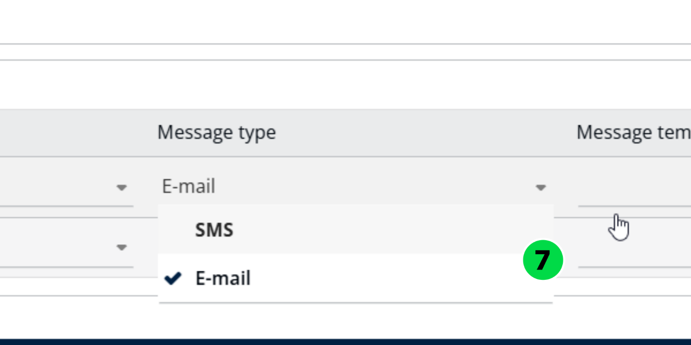

1. The Other Recipients field allows you to enter multiple email addresses or phone numbers, separated by commas\.

- Please note that the Other Recipients field is enabled only when Other Recipients is selected in the Recipient column\.

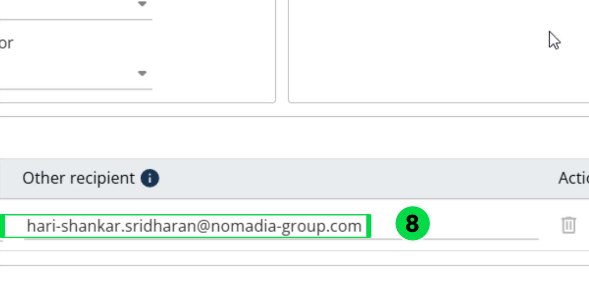

1. After completing the configuration, click Save to apply and store the changes\.

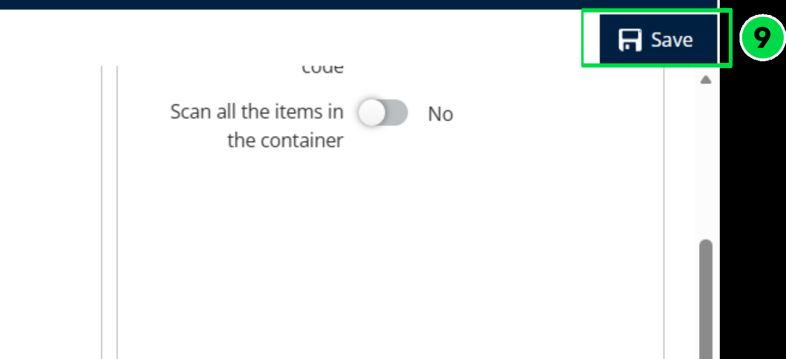

When the mobile user triggers a sub\-status, all configured recipients automatically receive the update via Email or SMS at the same time, providing real\-time information on the mission’s movement\.

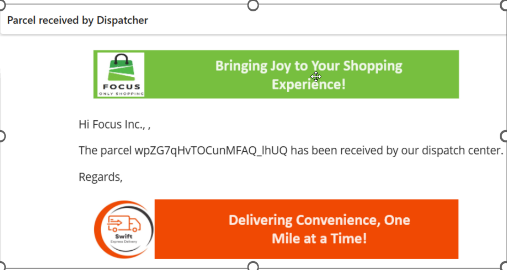

