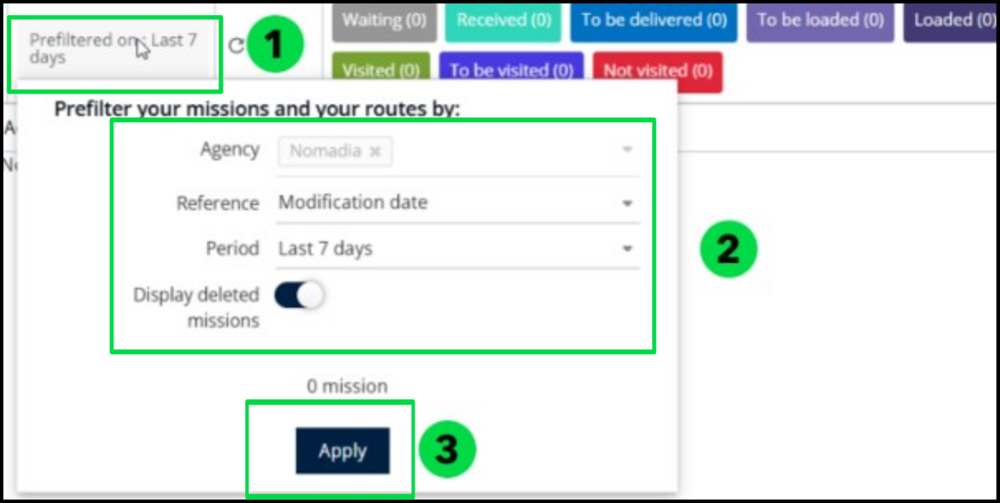
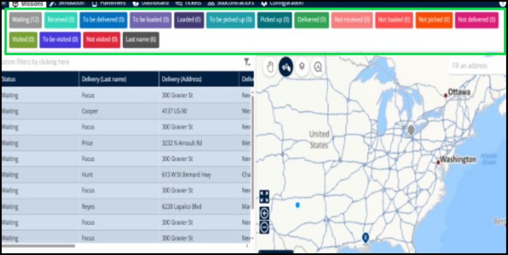

# 5. 5\. Understanding the Missions Page

A Mission refers to a task that must be executed, typically involving a pick\-up location and delivery address\. Each mission moves through a sequence of statuses that reflect its current stage\. Understanding these statuses is essential for monitoring the progress and handling any exceptions that may occur during the process\.

__Section ID__

__Section__

__Description__

A

Mission Table

Displays ongoing missions in a table format\. Supports up to 10,000 entries at a time\. Includes sorting and filtering options for easy data access\.

B

Map

Interactive map showing mission locations and route paths\. Help visualize geographic distribution and real time spatial tracking of mission statuses\. 

C

Routes Table

Gantt\-style view of routes, showing scheduling and duration\. Useful for understanding workload and mission sequence\. It outlines the agenda for the designated mobile user\.

D

Details

Shows detailed information for selected missions or routes, such as deliverer name, time slots, and status\. Helps in reviewing and making informed decisions\.

## 5.1 5\.1\. Set missions display \(prefilter\)

From the __Missions page__:

1. Click the "__Prefiltered On__" button at the top left, The display of this section may vary based on  

   screen resolution\. 

1. Choose Your Filters

- __Agency__: Select one or more agencies\.
- __Reference__: Filter by __Creation date__ or __Modification date__\.
- __Period__: Choose from options like the last hour, last 24 hours, last 7 days, or set a  

__      __custom date range\.

- __Display Deleted Missions__: Turn on if you want to include deleted missions\.

1. Click on __Apply__

 

1. The filtered missions will be displayed on your Missions page\.

## 5.2 5\.2\. Pre\-filters

The Pre\-filters on the Missions Page are dynamic sections that provide users with detailed and contextual information based on their current selection or interaction\. These pre\-filters enhance navigation and productivity by allowing quick access to relevant data without switching screens\.

\`

## 5.3 5\.3 Default Delivery statuses

Below are an overview of the various mission statuses and their significance:

__Status__

__Description__

Waiting

The mission is expected but not yet received

Received

The mission has been successfully received

To be Delivered

The mission is prepared for delivery

To be Loaded

The mission is waiting to be loaded\.

Loaded

The package is now loaded and in transit

To be Picked up

Mission is scheduled and awaiting pick up

Picked up

Item has been collected from the origin

Delivered

The delivery is completed successfully\.

Not Received

Indicates a mission was expected but couldn’t be received

Not Loaded

The mission couldn’t be loaded as expected

Not Picked up

Scheduled pickup was missed or failed\.

Not Delivered

The delivery failed

Visited

Destination has been successfully visited

To be Visited

Destination is scheduled for a visit\.

Not Visited

The scheduled visit was missed or unsuccessful\.

